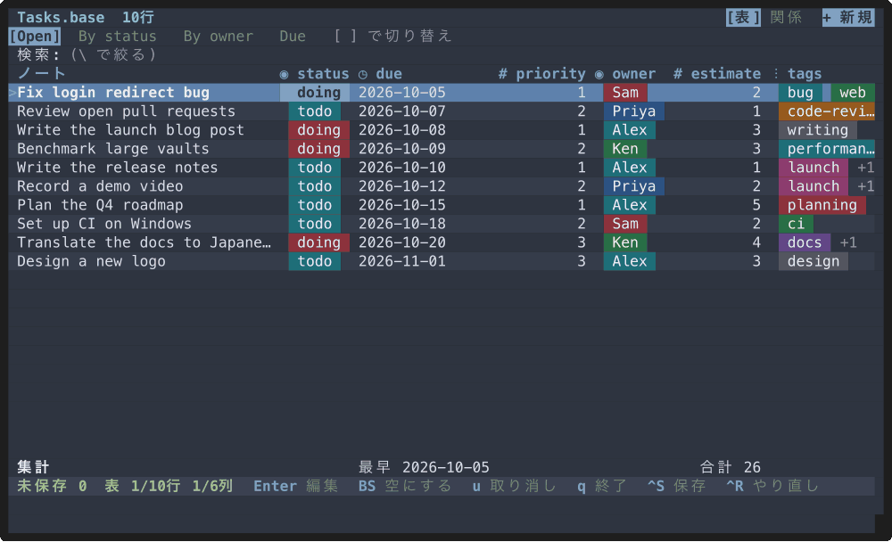
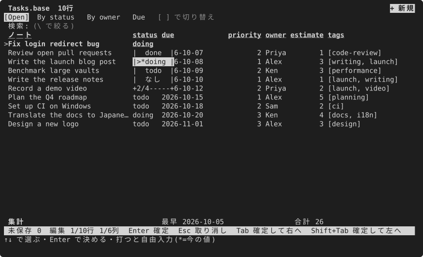
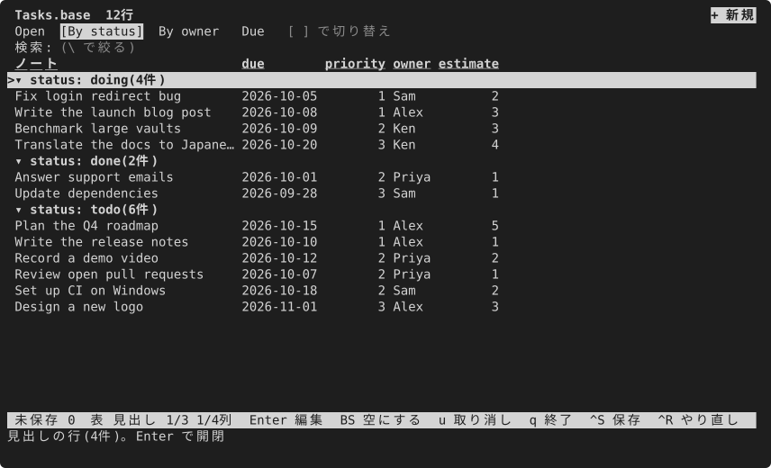

# mdgrid

[](https://github.com/S6U5/mdgrid/actions/workflows/ci.yml)
[](https://crates.io/crates/mdgrid)
[](https://github.com/S6U5/mdgrid/releases)
[](LICENSE-MIT)

**Markdown のフォルダを、ひとことで開ける自分の表に。**

mdgrid にフォルダを渡すと、ノートが行、フロントマターのキーが列の表になり、その場で値を直せます。フォルダに短い alias を付ければ、`tasks`・`books`・`meetings` がそのまま自分のコマンドになり、前に使ったときの表がそのまま開きます。

[English](README.md)



## ✨ できること

- **フォルダごとに1つのコマンド。** 用意は `alias tasks='mdgrid ~/notes/Tasks'` の1行だけです。mdgrid はフォルダごとに、列の並び・幅、絞り込み・並べ替え・まとまり、保存したビューを覚えているので、`tasks` と打てば毎回同じ表が開きます。データベースも取り込みも要らず、ノートはただの Markdown のままです。
- **フロントマターを表計算のように直す。** ほかのノートが使っている値から選ぶ、カレンダーで日付を選ぶ、タグとチェックボックスを切り替える、たくさんの行に同じ値を一度に入れる、新しいキーの列を足す、キーの名前を全部のノートで変える、ができます。
- **ファイルのほかの部分には触らない。** ほかのキー、キーの順、コメント、改行コード、本文は1バイトも変えません。書く前に、ファイルごとの差分を必ず見せます。
- **ほかのコマンドと組み合わせられる。** 表を CSV・JSON・Markdown で出す、出した CSV を表計算で直して戻す、画面で選んだノートのパスを次のコマンドに渡す、ができます。
- **キーボードで覚えやすい。** Vim のキーも矢印のキーも使えます。どのセルでも `x` を押せばそこでできることが、`?` で全部のキーが出ます。

ほかに: 7つの色のテーマ、英語と日本語の画面、Rust 製の単体の実行ファイル。Obsidian を使っているなら `.base` も開けます([下を参照](#-obsidian-を使っている人へ))。

## 📦 入れる

**ビルド済みのバイナリ。** [GitHub の Releases](https://github.com/S6U5/mdgrid/releases) の各リリースに、Linux(x86_64・aarch64)、macOS(Intel・Apple シリコン)、Windows(x86_64)のアーカイブがあります。展開して `mdgrid` を `PATH` の通った場所に置きます。シェルの補完(`completions/`)と man ページ(`mdgrid.1`)も入っています。

**crates.io から。** Rust 1.90 以上で:

```sh
cargo install mdgrid --locked
```

**ソースから。**

```sh
git clone https://github.com/S6U5/mdgrid.git
cd mdgrid
cargo install --path . --locked
```

Homebrew にはまだありません。

## 🚀 はじめる

### 1. 見本で試す

日本語の見本([examples/vault](examples/vault))で試せます。保存するとファイルが書き換わるので、先に一時フォルダに写します:

```sh
cp -R examples/vault /tmp/mdgrid-sample
mdgrid /tmp/mdgrid-sample/タスク
```

矢印のキーで動き、`Enter` で値を直し、`Ctrl+S` で差分を見て保存し、`q` で終わります。

英語の見本([examples/demo](examples/demo)。小さなチームの仕事の一覧)もあり、README の画面はこれで撮っています。見本の期日は 2026年10月の初めなので、画面の写しと同じに見るには今日とみなす日を渡します: `MDGRID_TODAY=2026-10-03 mdgrid /tmp/mdgrid-demo/Tasks`。

### 2. 自分のノートを開く

フォルダを渡します。はじめは `--readonly` を付ければ、書き込む心配なく見て回れます:

```sh
mdgrid ~/notes/Tasks --readonly
```

`.md` のファイルを1つ渡すと、そのフォルダを開いてそのノートの行を選びます。

### 3. 自分のコマンドにする

よく開くフォルダごとに、`~/.zshrc` か `~/.bashrc` に alias を書きます:

```sh
alias tasks='mdgrid ~/notes/Tasks'
alias books='mdgrid ~/notes/Books'
alias meetings='mdgrid ~/notes/Meetings --readonly'   # 見るだけ
```

これで `tasks` と打てばタスクの表が開きます。要らない列を隠し、`o` で絞り込みと並べ替えを決め、いくつかのビューをタブとして保存しておけば、次の `tasks` はその全部が当たった状態で開きます。(列の見出しからの一時的な並べ替えと、`\` の簡易の絞り込みは、終わるまでだけです。)

出す側も、シェルの関数で同じように自分のコマンドにできます:

```sh
todo() { mdgrid ~/notes/Tasks --print --format md --filter 'status != "done"' --sort due; }
```

fish では `alias --save tasks 'mdgrid ~/notes/Tasks'` です。

## ⌨️ まず覚えるキー

| したいこと | キー |
|---|---|
| 動く | 矢印のキー、か `h` `j` `k` `l` |
| 選んだ値を直す | `Enter` |
| このセルでできることを見る | `x`(か右クリック) |
| 変えたところを見て保存する | `Ctrl+S` |
| 終わる | `q` |
| 検索する・打ちながら行を絞る | `/`・`\` |
| 列の値ごとの件数を見て、1つの値だけ残す | `%` |
| 列・絞り込み・並べ替え・まとまりを決める | `o` |
| ビュー(タブ)を切り替える | `[`・`]` |
| 新しいキーの列を足す | `A` |
| コマンドを名前で呼ぶ | `:`(たとえば `:rename_key`・`:delete_key`) |
| 全部のキーと、セルの印の意味を見る | `?` |

キーはどれも設定で変えられます。[キー](docs/keys.ja.md)を見てください。画面の言葉は設定の `language`(`auto`・`en`・`ja`)で選びます。既定の `auto` は、`LC_ALL`・`LC_MESSAGES`・`LANG` が `ja` で始まれば日本語です。

## 🔍 もう少し詳しく

ほかのノートが使っている値から選ぶか、新しい値を打ちます。打つと候補が絞られます:



日付の列はカレンダーが開きます(日時の列は時刻の欄も):


保存するまで何も書かず、何が変わるかをそのまま見せます:


列で `%` を押すと値ごとの件数が出て、値を選ぶとその行だけが残ります:


`x` で、選んだセルでできることが出ます:


色のテーマは設定の `theme` で選びます: `"nord"`(下の画面)・`"solarized-light"`・`"dracula"`・`"gruvbox"`・`"pink-monster"`・`"dozy-pink"`。既定は端末の色のままで、`NO_COLOR` に従います。


テーマごとの設定の見本は [examples/themes/](examples/themes) にあります: `mdgrid --config examples/themes/nord.toml examples/demo`。

## 🧰 ほかのコマンドと使う

**表を出す。** `--print` は表を標準出力に出し、ノートは書き換えません。`--with-path` を付けると、先頭の列に各行のノートのパスが入ります。

```sh
mdgrid ~/notes/Tasks --print                       # 見出しの行つきの CSV
mdgrid ~/notes/Tasks --print --format json | jq .
mdgrid ~/notes/Tasks --print --format md > tasks.md
mdgrid ~/notes/Tasks --print --filter 'status != "done"' --sort due
```

**表計算で直して戻す。** `--with-path` を付けて出し、ファイルを直して `--apply` で戻します。`--yes` が無ければ差分を見せるだけです。

```sh
mdgrid ~/notes/Tasks --print --with-path > tasks.csv
mdgrid ~/notes/Tasks --apply tasks.csv          # 差分を見る(何も書かない)
mdgrid ~/notes/Tasks --apply tasks.csv --yes    # 変わったセルだけを書く
```

mdgrid は書く前に全部の行を確かめ、パスや値に1つでも問題があれば何も書きません。直していないセルは書き直しません。

**ノートを選んで渡す。** `--pick` は表を読むだけで開きます。行に印を付けて `Enter` を押すと、そのパスが1行ずつ出ます:

```sh
mdgrid ~/notes/Tasks --pick path | tr '\n' '\0' | xargs -0 -o vi
```

## 🪨 Obsidian を使っている人へ

mdgrid はどんな Markdown のフォルダでも使えますが、Obsidian の [Bases](https://help.obsidian.md/bases) も読めます。`.base` を開くと table ビューがタブに並び、絞り込み・並べ替え・まとまり・集計の行(`合計`・`平均`・`最早` など)と式の一部が使えます。Obsidian を入れていなくても動き、`.base` を書き換えることはありません。

```sh
mdgrid /tmp/mdgrid-sample/タスク.base                # ビュー: 進行中・状態ごと・期限・未対応の式・カード
alias standup='mdgrid ~/vault/タスク.base --view 状態ごと'
```

まとめたビューは見出しが付き、`Enter` で畳めます:



コマンドのパレットの `:export_base` は今のビューを新しい `.base` に書き出し、`:import_base` は `.base` のビューを mdgrid のビューとして取り込みます。`.obsidian/types.json` のプロパティの型も読みます。どこを読み、評価し、無視するかは [Obsidian Bases への対応](docs/obsidian-bases.ja.md)にあります。

## 📚 文書

- [説明書](docs/manual/ja/index.md) — はじめかた、やりたいことごとの手順、テーマ、全部の画面の写し。
- [設定](docs/config.ja.md) — 全部の項目と既定値。`mdgrid --print-config` は説明のコメント付きの設定を出すので、出発点にできます。
- [キー](docs/keys.ja.md) — モードごとの既定のキーと、変え方。
- [書き戻しの安全](docs/safety.ja.md) — 何を書き、何に触らないか。読むだけになるノートとその理由。
- [Obsidian Bases への対応](docs/obsidian-bases.ja.md) — `.base` のどこを読み、評価し、無視するか。
- [見本の設定と保管庫](examples/showcase/README.md) — ほとんどの機能を有効にした見本。`examples/vault` は、null・空・型の合わない値、読むだけのノート、同期の競合ファイルなどの端の形をそろえています。
- [人と AI のタスクを分ける見本](examples/ai-human/README.md) — AI エージェントに任せきれるタスクと、人の手が要るタスク(払う・署名する・提出する・送る)をまとまりに分け、人のまとまりを上に並べる `.base` と設定。
- シェルの補完は `mdgrid --completions <bash|zsh|fish|elvish|powershell>`、man ページは `mdgrid --man`。

## 🤝 参加する

バグを見つけた、こうなってほしい、という案があれば [Issue を開いて](https://github.com/S6U5/mdgrid/issues/new/choose)ください(日本語で大丈夫です)。mdgrid は作者と AI のコーディングのエージェントで直しているので、何をして、何を期待し、何が起きたかが分かる Issue があれば、たいていそれだけで直したり機能を足したりできます。Pull request は共同作業者だけにしています。詳しくは [CONTRIBUTING.md](CONTRIBUTING.md) を見てください。セキュリティの問題は [SECURITY.md](SECURITY.md) のとおり非公開で知らせてください。

## 🏗️ 作り方

仕様の正本は [specs/](specs/README.md) にあり、変更はどれも提案と決定の記録を通ります。人が決めた要件を守る試験には錠が掛かっていて、黙って弱めることはできません。

## 📄 ライセンス

[Apache License, Version 2.0](LICENSE-APACHE) と [MIT license](LICENSE-MIT) のどちらかを選んで使えます。

mdgrid は独立のプロジェクトで、Obsidian とは関係がなく、Obsidian の承認を受けたものでもありません。
