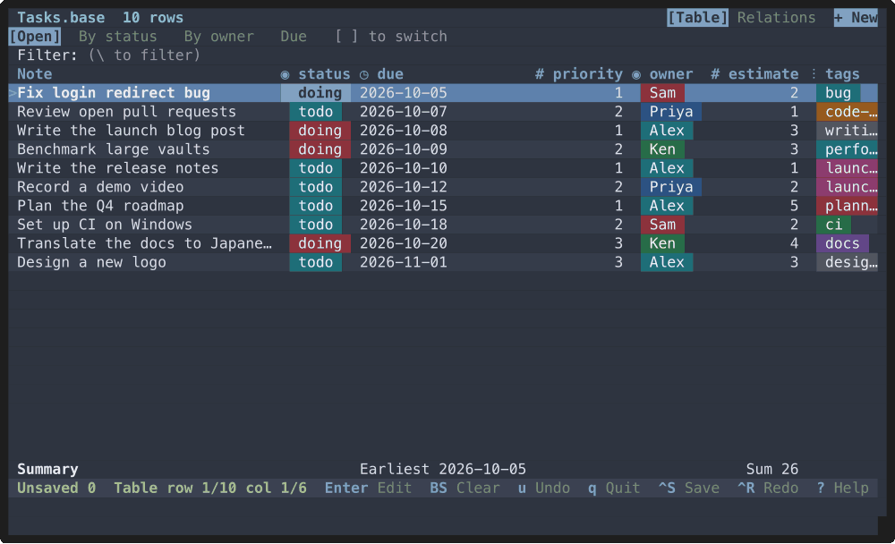
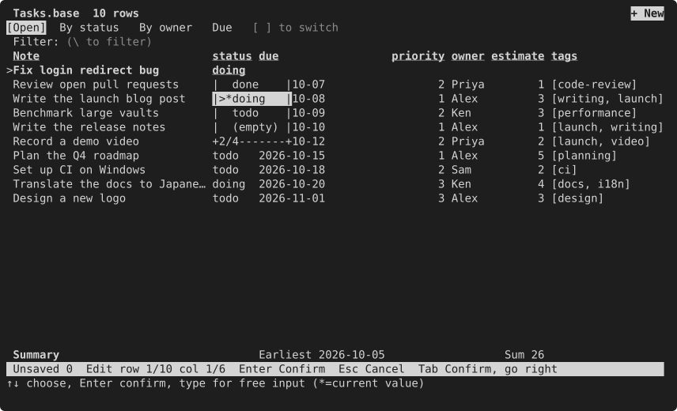
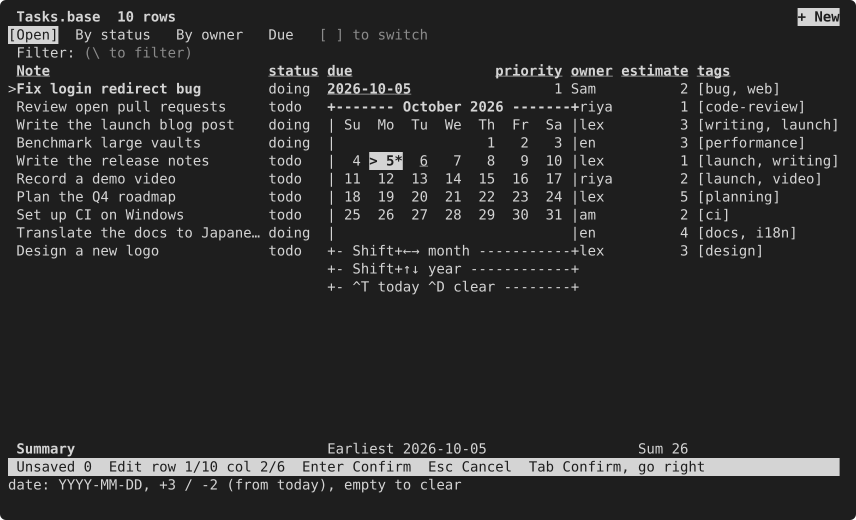
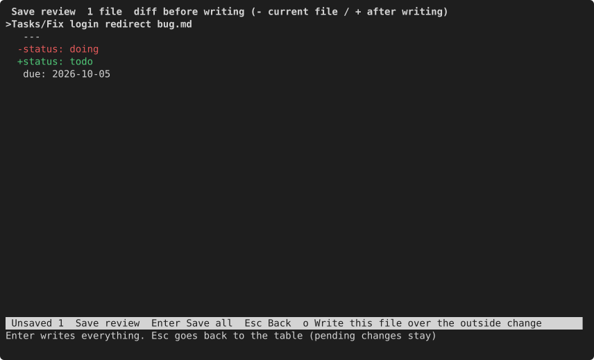
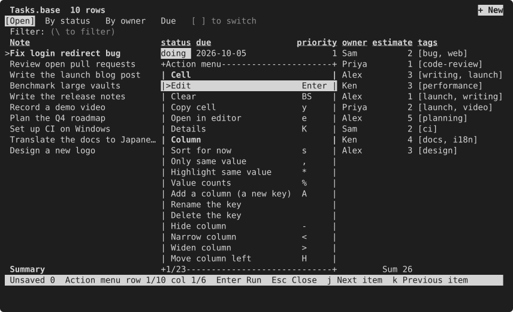
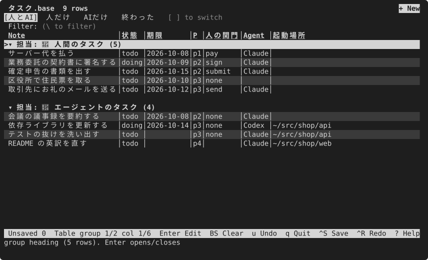
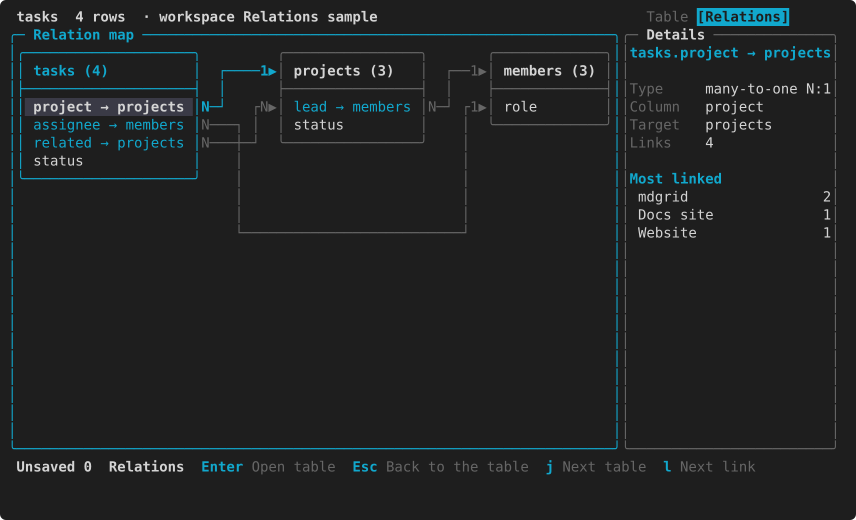
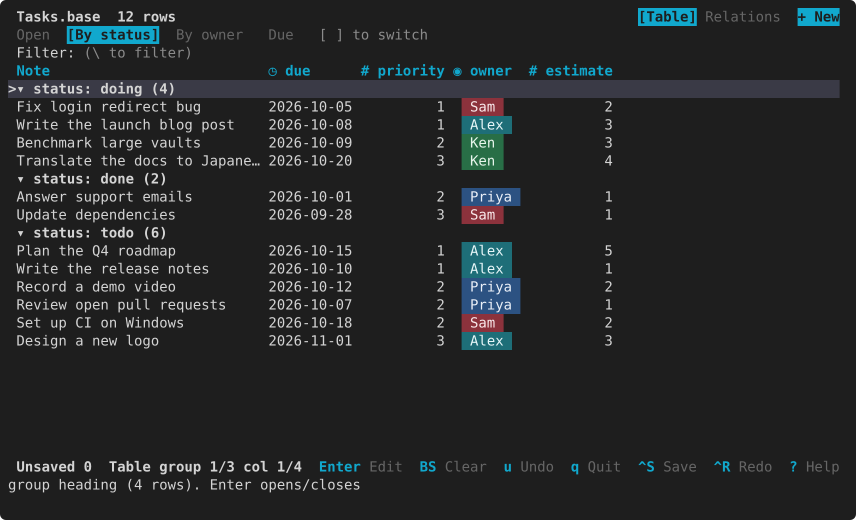

# mdgrid

[](https://github.com/S6U5/mdgrid/actions/workflows/ci.yml)
[](https://crates.io/crates/mdgrid)
[](https://github.com/S6U5/mdgrid/releases)
[](LICENSE-MIT)

**Turn each folder of Markdown notes into a table you open with one command.**

Point mdgrid at a folder and every note becomes a row, every frontmatter key a column. Edit the values right in the table. Give the folder a short alias, and `tasks`, `books` or `meetings` becomes your own command that opens that table just the way you left it.

[日本語](README.ja.md)



## ✨ What it does

- **One command per folder.** `alias tasks='mdgrid ~/notes/Tasks'` is all the setup there is. mdgrid remembers each folder's columns, widths, filters, sorting, grouping and saved views, so typing `tasks` brings back the same table every time. Or register the tables you use under a name and a group, and plain `mdgrid` lists them to switch between. No database, no import: the notes stay plain Markdown files.
- **Linked tables and a relation map.** Notes can link to each other (`project: "[[mdgrid]]"`), so folders work as linked tables: links show by name, Enter picks a target by name, and you can jump to it or list the notes that link back. Press `R` for a map of the tables and their links. Group the tables of a project into a workspace (or let mdgrid find the Obsidian vault or git repository) so links stay inside it.
- **Edit frontmatter like a spreadsheet.** Cells look like parts of a GUI table: checkboxes, colored chips for tags and statuses, and a type mark on each column. Pick from values other notes already use, choose dates on a calendar, toggle tags and checkboxes, set one value on many rows at once, add a column for a new key, or rename a key across every note.
- **Leaves the rest of the file alone.** Other keys, their order, comments, line endings and the body stay byte-for-byte the same. Before anything is written you see a diff of each file.
- **Works with other commands.** Print the table as CSV, TSV, JSON or Markdown — or export the table on screen to a file from the command palette — edit the CSV in a spreadsheet and bring the changes back, or choose notes on screen and hand their paths to the next command.
- **Easy to learn from the keyboard.** Vim keys and arrow keys both work. Press `x` on any cell to see what you can do there, `?` for every key.

Also: seven color themes, English and Japanese screens, a single binary written in Rust. If you use Obsidian, mdgrid can also open `.base` files ([see below](#-for-obsidian-users)).

## 📦 Install

**Prebuilt binaries.** Each release on the [GitHub Releases](https://github.com/S6U5/mdgrid/releases) page has archives for Linux (x86_64, aarch64), macOS (Intel, Apple silicon) and Windows (x86_64). Unpack one and put `mdgrid` on your `PATH`. The archive also holds shell completions (`completions/`) and a man page (`mdgrid.1`).

**From crates.io.** With Rust 1.90 or newer:

```sh
cargo install mdgrid --locked
```

**From source.**

```sh
git clone https://github.com/S6U5/mdgrid.git
cd mdgrid
cargo install --path . --locked
```

mdgrid is not on Homebrew yet.

## 🚀 Get started

### 1. Try it on the demo

The demo is a small team's task list. Copy it first, so saving does not change the repository:

```sh
cp -R examples/demo /tmp/mdgrid-demo
mdgrid /tmp/mdgrid-demo/Tasks
```

Move with the arrow keys, press `Enter` to change a value, `Ctrl+S` to see the diff and save, and `q` to quit.

The demo's due dates are in early October 2026. To see the same overdue marks as in the screenshots, set the date mdgrid treats as today: `MDGRID_TODAY=2026-10-03 mdgrid /tmp/mdgrid-demo/Tasks`.

Every sample at once, from a clone of the repository. `demos/try.sh` builds mdgrid, copies the sample to a temporary folder, opens it with its own config, and deletes the copy when you quit, so your notes and settings are never touched:

```sh
git clone https://github.com/S6U5/mdgrid && cd mdgrid
sh demos/try.sh demo        # the demo above (a team's task list)
sh demos/try.sh relations   # tasks → projects → members linked by [[links]]; press R for the relation map
sh demos/try.sh workspace   # the same tables grouped into a workspace (-w Work)
sh demos/try.sh ai-human    # a .base that splits tasks into human and AI work
sh demos/try.sh showcase    # a config that turns most features on (Japanese)
sh demos/try.sh vault       # edge cases: empty and mismatched values, read-only notes (Japanese)
```

Anything after `--` goes to mdgrid, for example `sh demos/try.sh demo -- --readonly`.

### 2. Open your own notes

Give mdgrid a folder. Add `--readonly` the first time to look around without any chance of writing:

```sh
mdgrid ~/notes/Tasks --readonly
```

Giving a single `.md` file opens its folder with that note selected.

### 3. Make it your own command

Add an alias for each folder you open often to your `~/.zshrc` or `~/.bashrc`:

```sh
alias tasks='mdgrid ~/notes/Tasks'
alias books='mdgrid ~/notes/Books'
alias meetings='mdgrid ~/notes/Meetings --readonly'   # only for looking
```

Now `tasks` opens your task table. Hide the columns you don't need, set a filter and a sort with `o`, save a few views as tabs, and the next `tasks` opens with all of it in place. (A quick sort from a column header and the quick filter `\` last only until you quit.)

A shell function works the same way for the output side:

```sh
todo() { mdgrid ~/notes/Tasks --print --format md --filter 'status != "done"' --sort due; }
```

In fish, use `alias --save tasks 'mdgrid ~/notes/Tasks'`.

## ⌨️ Keys to start with

| To do this | Press |
|---|---|
| Move around | Arrow keys, or `h` `j` `k` `l` |
| Change the selected value | `Enter` |
| See what you can do with this cell | `x` (or right-click) |
| Review the changes and save | `Ctrl+S` |
| Quit | `q` |
| Search · filter rows as you type | `/` · `\` |
| Count the values in a column, and keep only one | `%` |
| Choose columns, filters, sorting and grouping | `o` |
| Switch between views (tabs) | `[` · `]` |
| Add a column for a new key | `A` |
| Run any command by name | `:` (for example `:rename_key`, `:delete_key`) |
| See every key and what the marks in cells mean | `?` |

Every key can be changed in the config; see [Keys](docs/keys.md).

## 🔍 A closer look

Pick a value that other notes use, or type a new one. Typing narrows the list:



Date columns open a calendar (with a time field for date-and-time columns):



Nothing is written until you save, and you see exactly what will change:



Press `%` on a column to count its values, and pick one to keep only those rows:


Press `x` to see what you can do with the selected cell:



Group and arrange the table the way you work. With a formula in a `.base` and a few lines of config, the [ai-human sample](examples/ai-human/README.md) splits tasks into those that need a person (pay, sign, submit, send) and those an AI agent can finish, with the people's group on top:



Press `R` for the relation map: the tables of the workspace as boxes, with an arrow from each link column to the table it points at (`N:1`, or `N:N` for a list of links). Click a table or a link, or move with the arrow keys:



Pick a color theme with `theme` in the config: `"nord"` (below), `"solarized-light"`, `"dracula"`, `"gruvbox"`, `"pink-monster"` or `"dozy-pink"`. The default keeps your terminal's colors, and `NO_COLOR` is respected.


[examples/themes/](examples/themes) has a sample config for each theme: `mdgrid --config examples/themes/nord.toml examples/demo`.

## 🧰 Use with other commands

**Print the table.** `--print` writes the table to standard output and never changes your notes. Add `--with-path` to get each row's note path as the first column.

```sh
mdgrid ~/notes/Tasks --print                       # CSV with a header row
mdgrid ~/notes/Tasks --print --format json | jq .
mdgrid ~/notes/Tasks --print --format md > tasks.md
mdgrid ~/notes/Tasks --print --filter 'status != "done"' --sort due
```

**Edit in a spreadsheet and bring it back.** Export with `--with-path`, edit the file, then `--apply` it. Without `--yes` it only shows the diff.

```sh
mdgrid ~/notes/Tasks --print --with-path > tasks.csv
mdgrid ~/notes/Tasks --apply tasks.csv          # show the diff, write nothing
mdgrid ~/notes/Tasks --apply tasks.csv --yes    # write only the cells that changed
```

mdgrid checks every row before writing. If any path or value is a problem, nothing is written. Cells you did not change are never rewritten.

**Choose notes and pass them on.** `--pick` opens the table read-only. Mark rows, press `Enter`, and their paths are printed one per line:

```sh
mdgrid ~/notes/Tasks --pick path | tr '\n' '\0' | xargs -0 -o vi
```

## 🪨 For Obsidian users

mdgrid works on any folder of Markdown notes, and it also understands Obsidian's [Bases](https://help.obsidian.md/bases). Open a `.base` file and its table views appear as tabs, with their filters, sorting, grouping, summary rows (`Sum`, `Average`, `Earliest` …) and a subset of formulas. Obsidian does not need to be installed, and mdgrid never rewrites your `.base` files.

```sh
mdgrid /tmp/mdgrid-demo/Tasks.base                    # four views: Open, By status, By owner, Due
alias standup='mdgrid ~/vault/Tasks.base --view "By owner"'
```

Grouped views show headings that you can fold with `Enter`:



From the command palette, `:export_base` writes the current view to a new `.base`, and `:import_base` takes a `.base` view in as an mdgrid view. mdgrid also reads the property types in `.obsidian/types.json`. See [Obsidian Bases support](docs/obsidian-bases.md) for what is read, evaluated or ignored.

## 📚 Documentation

- [User manual](docs/manual/en/index.md) — getting started, task guides, the themes, and a screenshot of every screen. New to mdgrid? Read [How mdgrid sees your notes](docs/manual/en/concepts.md) first; [Make it look the way you like](docs/manual/en/appearance.md) and [When something looks wrong](docs/manual/en/faq.md) cover the look and the usual questions.
- [Configuration](docs/config.md) — every setting, with defaults. `mdgrid --print-config` prints a commented starting file.
- [Feature tours](demos/README.md) — short GIFs of entering values by type, the new-note form, exporting, registered tables, relations, the relation map, workspaces and the themes, recorded for each release. `sh demos/try.sh <sample>` opens a sample in a throwaway copy.
- [Keys](docs/keys.md) — the default keys of each mode, and how to change them.
- [Write-back safety](docs/safety.md) — what mdgrid writes, what it never touches, and which notes stay read-only and why.
- [Obsidian Bases support](docs/obsidian-bases.md) — which parts of `.base` files mdgrid reads, evaluates or ignores.
- [Showcase](examples/showcase/README.md) — a sample config and vault (in Japanese) that turn most features on. `examples/vault` covers the edge cases: null, empty and mismatched values, read-only notes, sync conflicts.
- [Human and AI tasks](examples/ai-human/README.md) — a sample `.base` and config (in English in `vault-en`, in Japanese in `vault`) that splits tasks into those an AI agent can finish and those that need a person (pay, sign, submit, send), with the people's group on top.
- Shell completions: `mdgrid --completions <bash|zsh|fish|elvish|powershell>`. Man page: `mdgrid --man`.

## 🤝 Contributing

Found a bug or have an idea? [Open an issue](https://github.com/S6U5/mdgrid/issues/new/choose). mdgrid is maintained by its author together with an AI coding agent, so a clear issue — what you did, what you expected, what happened — is usually all it takes to get a fix or a feature. Pull requests are limited to collaborators; see [CONTRIBUTING.md](CONTRIBUTING.md). Please report security problems privately as described in [SECURITY.md](SECURITY.md).

## 🏗️ How it is developed

The specification lives in [specs/](specs/README.md) and every change goes through a recorded proposal and decision (in Japanese). Tests that guard requirements decided by a person are locked, so they cannot be weakened silently.

## 📄 License

Licensed under either of [Apache License, Version 2.0](LICENSE-APACHE) or [MIT license](LICENSE-MIT) at your option.

mdgrid is an independent project. It is not affiliated with or endorsed by Obsidian.
