# Task guides

[日本語](../ja/tasks.md) · [Contents](index.md)

- [Task guides](#task-guides)
  - [Edit values and save](#edit-values-and-save)
  - [Find, filter and sort](#find-filter-and-sort)
  - [Edit many rows at once](#edit-many-rows-at-once)
  - [Create a note](#create-a-note)
  - [Open a .base file](#open-a-base-file)
  - [Shape a view and save it](#shape-a-view-and-save-it)
  - [Give a folder its own command](#give-a-folder-its-own-command)
  - [Register the tables you use and switch between them](#register-the-tables-you-use-and-switch-between-them)
  - [Link tables with relations](#link-tables-with-relations)
  - [Group tables into workspaces](#group-tables-into-workspaces)
  - [Use with other commands](#use-with-other-commands)
  - [Choose a theme](#choose-a-theme)
  - [When you cannot edit](#when-you-cannot-edit)

`mdgrid` in the examples is the `target/release/mdgrid` you built, and `/tmp/mdgrid-sample` is the sample vault copied in [Getting started](getting-started.md#open-the-sample-vault).

## Edit values and save

1. Select a cell and press `Enter`. The input depends on the column's type:
   - Text: pick from the values other notes have in this column (when there are at most `candidates` distinct values, 20 by default; otherwise just type), or type a new one.
   - Date: a calendar opens. `←` `→` move by day, `↑` `↓` by week, `PageUp` and `PageDown` by month. You can also type `2026-10-15`, or `+3` for three days from today. `Ctrl+T` is today.
   - Date and time: the same calendar, with a time field under it. `Ctrl+O` switches to the time field, where `↑` `↓` move 15 minutes and `Shift+↑` `Shift+↓` one hour. Changing only the day keeps each note's time; you can also type `2026-10-15T09:30`.
   - List (such as `tags`): toggle values from the list of values found in the vault.
   - Checkbox: each `Enter` cycles empty → true → false → empty.これ
   - Number: only values that read as numbers are accepted.
2. Press `Enter` to confirm, `Esc` to cancel, or `Tab` to confirm and move right.
3. The edited cell is marked and `Unsaved` in the bottom bar goes up. Nothing is written yet. `u` undoes, `Ctrl+R` redoes.
4. `Ctrl+S` (or `:w`) opens the save review: a before/after diff for each file.
5. `Enter` writes everything. `Esc` goes back to the table without writing; the pending changes stay.

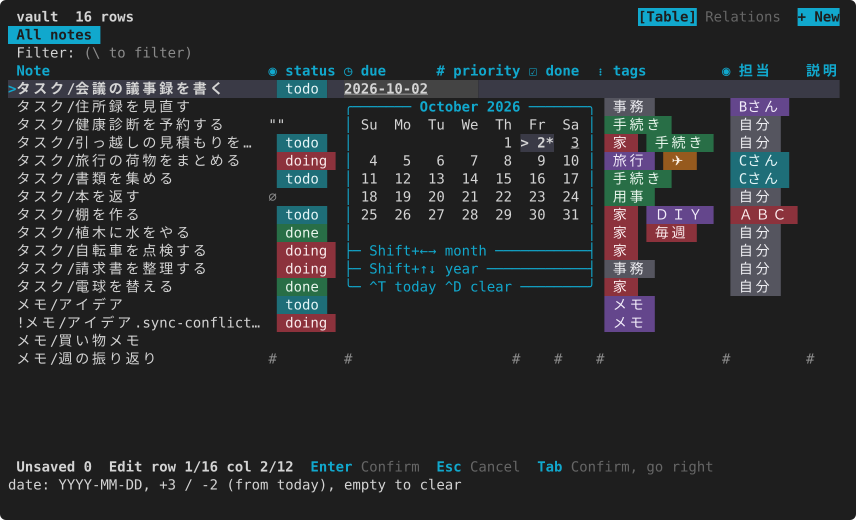

Date and time columns add a time field under the calendar (here on the sample `examples/schedule`). `Ctrl+O` switches to it; `↑` `↓` move 15 minutes and `Shift+↑` `Shift+↓` one hour.

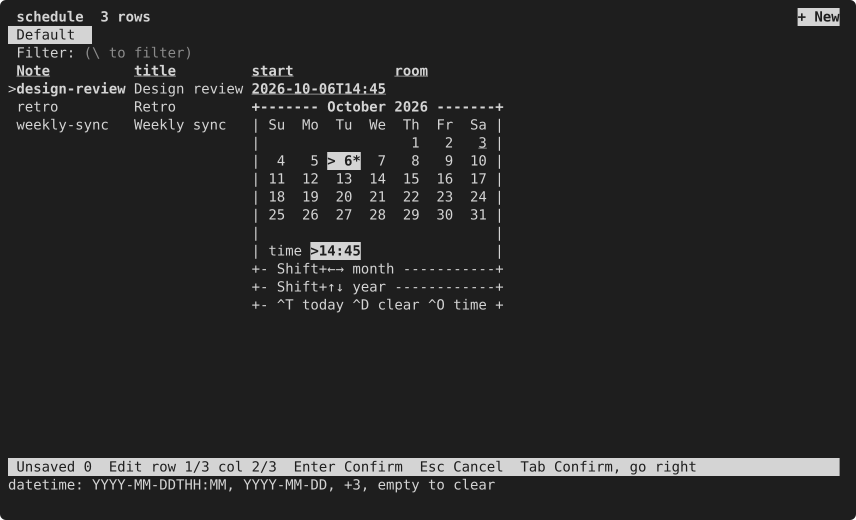

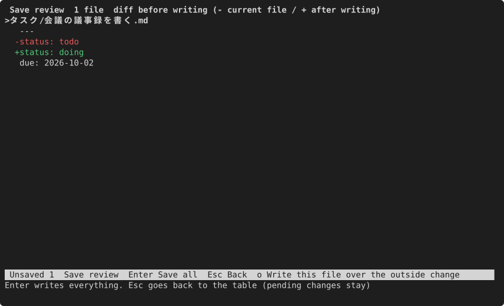

- To empty a cell press `Backspace` or `Delete`. Saving writes `key:` and keeps the key.
- `q` with unsaved changes asks: `s` save and quit, `d` discard and quit, `Esc` back.
- `K` shows every property of one note (details), long values in full; `Enter` edits one.
- Edit the body or values with line breaks in your editor with `e`; mdgrid re-reads the note when you return. The editor is the `editor` setting, else `$VISUAL`, `$EDITOR`, then `vi`.

mdgrid writes only the values you changed. A missing key gets one added line, and a note without frontmatter gets frontmatter added at the top (the body is untouched). If a note changed on disk before you save, the review shows it and lets you choose to write over it (`o`). The details are in [Write-back safety](../../safety.md).

## Find, filter and sort

| To | Keys |
|---|---|
| highlight a word and move between matches | `/`, type, `Enter`; then `n`, `N` |
| keep only rows containing a word | `\` and type (filters as you type and shows the count); `Esc` clears |
| keep only rows with the selected cell's value | `,` (`*` only highlights them) |
| sort by this column | `s` or click the heading (ascending → descending → off) |
| build a sort (several columns, directions, order) | `S` or the **Sort** button at the right of the filter bar |
| go to a row number | `:`, the number, `Enter` |
| hide a column / show it again | `-` / `+` |
| move a column / change its width | `H` `L` / `<` `>` |
| freeze the columns on the left while scrolling | `F` |

Search ignores case when the word is all lowercase. `Esc` clears the selection first, then the filter, then the search highlight.

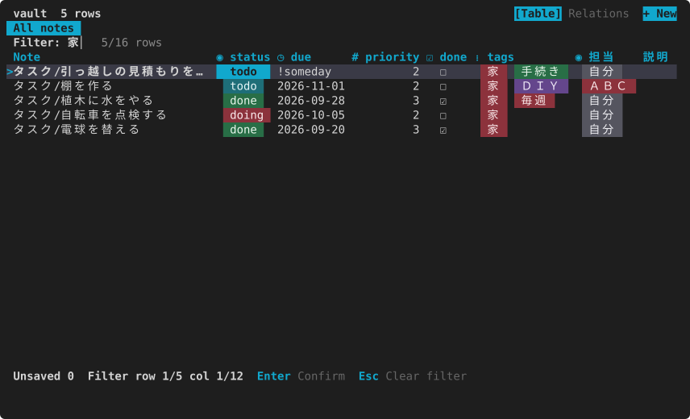

A sort is kept for the current view, so the table opens in the same order next time (the `.base` file is not changed). In the sort window you can add a rule (`Enter`, then pick a column), flip its direction (`Enter`), remove it (`d`) and reorder (`K`, `J`); every change applies right away. The quick filter `\` is temporary. To keep more, see [Shape a view and save it](#shape-a-view-and-save-it).

## Edit many rows at once

To rename a note, use **Rename the note** in the action menu (`x`) or the palette (`:`). Links to the old name (`[[old name]]`) are rewritten as pending changes; review the diff with `Ctrl+S` and save.

1. Mark rows with `Space` (it marks and moves down). `v` marks a range, `Ctrl+A` all rows.
2. On one of the marked rows, open the cell of the column to change with `Enter` and choose the value.
3. Every marked row gets the same value. Rows that cannot take it (read-only notes, for example) are skipped, with the count and the reason.

In a list column, a value every row has shows as `[x]` and a value only some rows have as `[-]`. Each row keeps its other items.

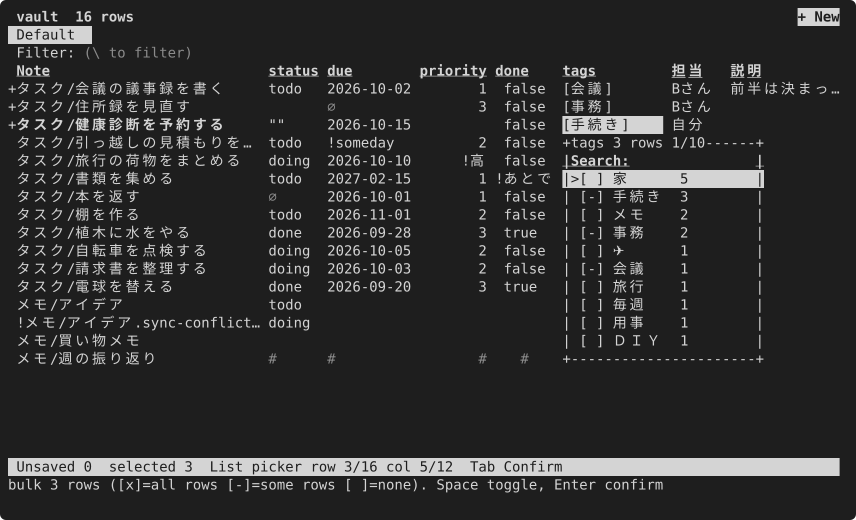

Nothing is written until you save, so the `Ctrl+S` diff lets you check all of it at once.

## Create a note

1. Press `a`, or click `+ New` at the top right. A form opens with the name and a field for each column.
2. Type a name. `sub/name` creates it in a subfolder (made if missing). `Enter` and `Tab` move to the next field, `Shift+Tab` back; each field takes the input for its type (candidates, calendar, list).
3. Press `Ctrl+S` from any field (or `Enter` on the last one). The file is created at once and its row is selected. `Ctrl+E` creates it and opens it in your editor.

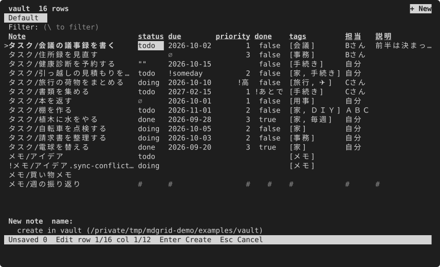

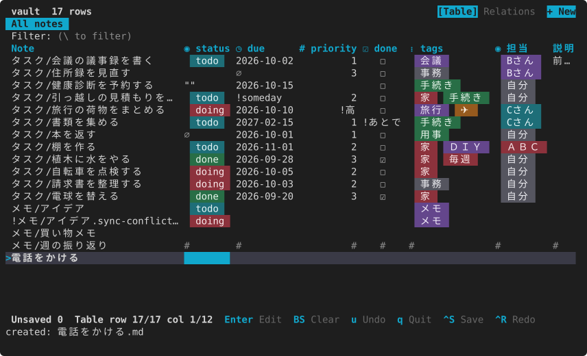

- With two or more folders open, you choose the folder first.
- In a view filtered to a single value, such as `status == "doing"`, the new note gets that value and stays in the view.
- mdgrid does not create notes outside the opened folders or over an existing name, and not at all with `--readonly`.
- The fields, required fields, preset values (with variables such as `{date+7}` or `{now}`), hidden values such as a creation date, a body template, and whether to use the form or go straight to the editor (`mode = "editor"`) are set in [`new_note`](../../config.md#new_note).

## Open a .base file

```sh
mdgrid /tmp/mdgrid-sample/タスク.base
mdgrid /tmp/mdgrid-sample/タスク.base --view 期限
```

The table views of the `.base` appear as tabs, and the first one (or the one named by `--view`) opens. Switch with `[` and `]`. mdgrid reads filters, order, sort, groupBy, limit, displayName and formulas; `Enter` on a group heading folds the group.

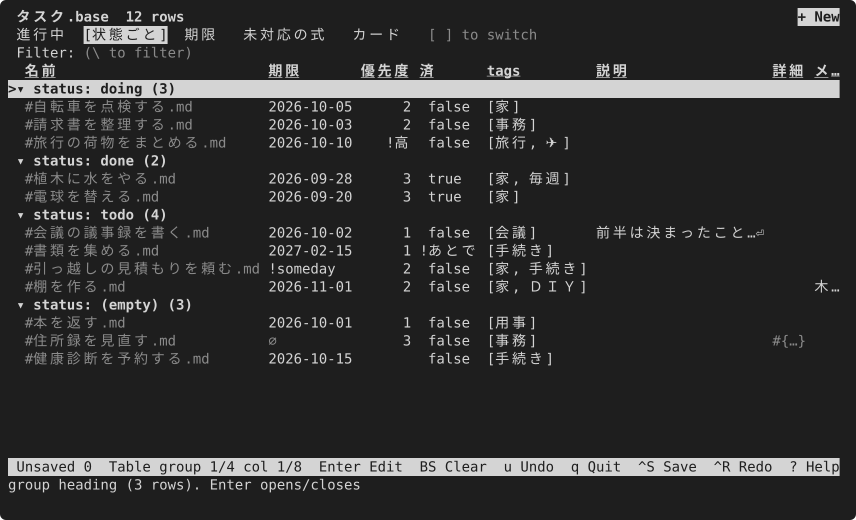

- A formula mdgrid cannot evaluate shows a dim `?` instead of a guess; select it to see which formula.
- Views other than table (cards, for example) do not open; mdgrid says why.
- mdgrid never rewrites a `.base` file.

What mdgrid reads — keys, operators, functions — is listed in [Obsidian Bases support](../../obsidian-bases.md).

## Open a CSV or TSV as a ledger

```sh
mdgrid /tmp/mdgrid-sample/備品.csv
```

Pass one `.csv` or `.tsv` file and mdgrid opens it as a table: the first line names the columns, each following line is a row. Editing values, undo, the diff before saving, filters, sorting, grouping, saved views and `--print` work as they do for a folder of notes.

- Saving rewrites only the characters of the values you changed. Other lines, the quoting, the line endings (LF or CRLF) and a leading BOM stay as they were. A value is quoted only when it contains `,`, `"` or a line break.
- It is one file, so however many rows you change, the save review shows one diff for the file and writes it once. If the file changed elsewhere after you opened it, mdgrid does not write.
- `a` adds an empty row at the end of the file (written right away) and opens the input on its first column.
- Only UTF-8 is read. A Shift_JIS file, for example, does not open and mdgrid says why (save it as UTF-8 to open it). A line whose number of values differs from the header is read-only; select it to see why.
- Features that only make sense for notes (open in the editor, rename the note, rename or remove a key, add a column, links and the relation map, parent and child rows, export to `.base`) are not shown, and their keys only say why.
- Line endings may be LF or CRLF. A file whose lines end with a lone CR does not open; mdgrid says why. A repeated column name becomes `name#column number` from the second one on, and an empty one becomes `#column number`.
- With `--print --with-path` the path is the file and the row number, like `ledger.csv#2`, and `--apply` brings changes back to that row.
- Links between a CSV and notes (relations) are not supported yet. You can register a CSV table in the list of tables or a workspace and open it from there, but it is left out of links and the relation map.

## Shape a view and save it

`o` opens the view settings. `Tab` moves between sections:

- Columns: which columns to show, and their order
- Filters: add conditions. Choosing a column lists its values with counts, and you tick the values to keep or hide
- Sort and group
- Tree (parent/child): when on, child notes with `parent: "[[Parent]]"` (the key can be changed) are indented under their parent. `Z` or a click on ▾ / ▸ folds or unfolds a parent. Sorting works among siblings, and a child whose parent is not in the table stays at the top level. In the same section, turn on WBS to number the rows (`1.2.1`) and build a table of values for the progress key (default `status`): type a percent and a label for each value (for example `100 Done`; `-` removes it). Rows without children show the label, parents show the average percent of their descendants. The table is saved with the view settings
- Display: row numbers, zebra stripes, column lines, tabs, the search bar, the settings band
- Views: the tabs above the table. `Space` shows or hides a tab, `K` / `J` move it, `Enter` makes it the default, renames or deletes it, and the last row turns the "[ ] to switch" hint on or off. These changes are saved to `views.toml` right away, without `Apply` (the view you are on cannot be hidden, and `.base` views cannot be renamed or deleted)
- Look: choose where to save ("Save to": global, this workspace, this table or this view), then pick the theme, parts and round pill ends with `Enter`; the theme and parts show where their current value comes from, such as `(this table)`. `Apply` shows them and keeps them in that place (`ui.toml`, `workspaces.toml`, `views.toml` or the view settings; `config.toml` and the workspace marker are never rewritten). "+ Save this look as a template" names the combination; pick a template to use it, `d` deletes it. "Remove the override of this place" goes back to the wider place

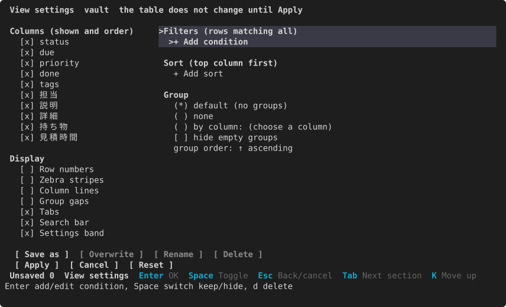

`Apply` applies it to the table; `Save as` keeps it as an mdgrid view. **Make this the default view** in the palette (`:`) or the action menu (`x`) makes the current view the one that opens next time (pick the first tab to go back to it). On the same screen, `Overwrite`, `Rename` and `Delete` manage saved views, and `Reset` returns the settings to the defaults. A saved view becomes a tab next to `Default table` (with `[display] tabs = "auto"` the tab row appears only from then on) and is written to `views.toml` in the config folder. The conditions in effect are shown in the settings band above the table; `f` moves into the band and `Backspace` removes one.

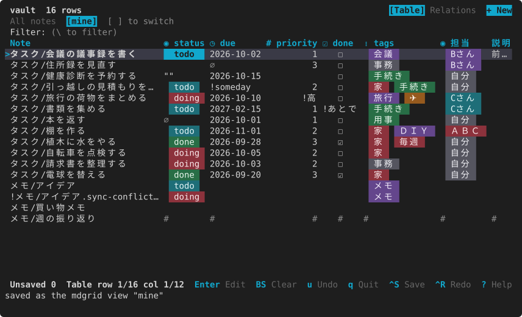

To go back and forth with Obsidian, use the palette (`:`):

- `export_base`: write the current view to a new `.base` you name (an existing `.base` is never rewritten)
- `import_base`: take a `.base` view in as an mdgrid view (the parts it cannot hold are listed as dropped)

With `--readonly`, view settings are not remembered.

## Give a folder its own command

mdgrid remembers each folder (or `.base`) you open: the columns you show and their order and widths, the filters, sorting and grouping set with `o`, the folded groups, and the views you saved as tabs. The next time you open the same folder, all of it comes back. So a shell alias is enough to turn a folder into a command of your own.

Add one line per folder to `~/.zshrc` or `~/.bashrc`:

```sh
alias tasks='mdgrid ~/notes/Tasks'
alias books='mdgrid ~/notes/Books'
alias meetings='mdgrid ~/notes/Meetings --readonly'   # only for looking
alias standup='mdgrid ~/notes/Tasks.base --view "By owner"'   # a .base, opened on one view
```

- Typing `tasks` opens the task table the way you left it.
- What is not remembered: the quick filter `\` and anything you change with `--readonly` (sorts from a heading or the sort window are remembered).
- In fish: `alias --save tasks 'mdgrid ~/notes/Tasks'`.

The output side works the same way with a shell function:

```sh
todo() { mdgrid ~/notes/Tasks --print --format md --filter 'status != "done"' --sort due; }
pick-task() { mdgrid ~/notes/Tasks --pick path; }
```

## Register the tables you use and switch between them

You can register a table you open often (a folder or a `.base`) under a name and a group. On that table, choose **register this table** in the palette (`:`), then set the name (the current view or folder name is filled in) and the group (pick one you already have or type a new one). If the name is taken, mdgrid asks before replacing it.

Once something is registered, running `mdgrid` with no arguments shows the list, grouped, on top of the current folder's table. Type part of a name, group or path to narrow it, and press Enter to open one (on its registered view).

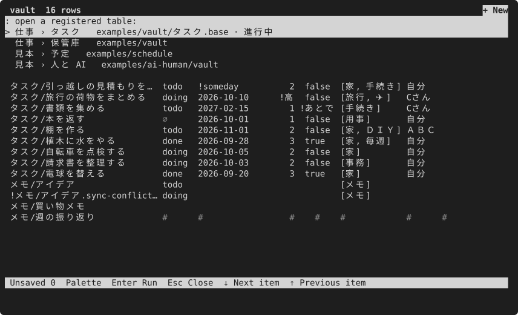

 The first row, "this folder", or Esc keeps the current folder. While a table is open, **open a registered table** in the palette shows the same list. If you have unsaved changes, mdgrid asks whether to save or discard them before switching.

Registrations live in `places.toml` in the config folder (`~/.config/mdgrid/places.toml`). You can also write it by hand:

```toml
[[place]]
name = "Tasks"
group = "Work"
path = "~/notes/Tasks"

[[place]]
name = "Books"
group = "Personal"
path = "~/notes/Books.base"
view = "Reading"
```

A leading `~` in `path` means your home folder. Rows that cannot be read (no `name` or `path`, or a repeated name) are skipped with a warning. Notes are never written.

## Link tables with relations

A note can point at another note with a link in its frontmatter, so folders of notes work like linked tables (tasks → projects → members). The note's file name is the key: there is no id column, and a list of links stands in for a many-to-many join table.

```yaml
project: "[[mdgrid]]"            # one project
assignee: "[[Alice]]"
related:                         # many
  - "[[Website]]"
  - "[mdgrid](../projects/mdgrid.md)"   # a Markdown link works too, and so does a plain path: ../projects/mdgrid
```

- Link cells show the target note's name. A `[[…]]` whose note does not exist is shown with `?` in front.
- In a column whose values are mostly links, Enter lists the notes in the target's folder by name. The one you pick is written in the form the column already uses (`[[name]]` if none). In a list column you can tick several.
- `:open_link` (or **Open the link target** in the `x` menu) opens the target: in the same table it moves to the row; otherwise it opens the registered table that holds the note (or its folder) and selects the row. Unsaved changes are confirmed first.
- `:linked_rows` lists the notes that link to the current one, with the table and column they link from. Pick one to open it.
- Links work whether you open a folder or a `.base`, and may point outside the opened folder. Register the folders you link between (see above) so names resolve across them. A value counts as a plain-path link only if it contains `/` or ends in `.md` and the note exists, so ordinary words stay text.

The sample `examples/relations` has tasks, projects and members linked this way: `mdgrid examples/relations/tasks`.

**The relation map.** Press `R` (or click **Relations** in the tabs at the top right) to see the tables as boxes with their row counts and columns, and an arrow from each link column to the table it points at (`N` → `1`, or `N` → `N` for a list of links). `↑` `↓` pick a table, `←` `→` pick a link; the details and, on a tall terminal, the linked records follow the selection. The layout adapts to the terminal width. You can also click: a table selects it and a second click opens it, a line or an arrow selects that link, and a linked record opens its note. Press `R` again to go back to the table. The map covers the current workspace (see below), or the registered tables if there is none.

## Group tables into workspaces

A workspace is a named set of tables (folders or `.base` files). When the table you open belongs to one, links, linked rows, the relation map and the tabs at the top right use only that workspace's tables, so a vault for work and one for hobbies do not mix. The header shows `· workspace <name>`.

In the palette (`:`): **create a workspace with this table**, **add this table to a workspace** (pick one or type a new name), **remove this table from a workspace**, and **open a workspace** (pick it, then one of its tables). From the shell (with no path, `--add-to` and `--remove-from` use the current folder):

```sh
mdgrid ~/notes/tasks --add-to Work
mdgrid ~/notes/projects --add-to Work --as Projects
mdgrid --workspaces                          # list them
mdgrid -w Work                               # open the first table of Work
mdgrid -w Work ~/notes/tasks                 # open this table within Work
mdgrid ~/notes/tasks --remove-from Work
mdgrid --remove-workspace Work               # the notes are not touched
```

Workspaces live in `workspaces.toml` in the config folder, next to `places.toml`:

```toml
[[workspace]]
name = "Work"

[[workspace.table]]
name = "Tasks"
path = "~/notes/tasks"

[[workspace.table]]
name = "Projects"
path = "~/notes/projects"
view = "Open"
```

To keep the workspace with the notes instead (for example in a repository you share), run `mdgrid --init-workspace` in its root (or `mdgrid <folder> --init-workspace`). It writes `.mdgrid/workspace.toml`; with no `[[table]]` in it, every folder of notes directly under the root is a table (a `.base` is not added automatically, because it covers the whole vault; list it with `[[table]]` to include it).

Which tables are in scope, first match wins: `-w` → the nearest `.mdgrid/workspace.toml` above the opened folder → the first workspace in `workspaces.toml` that holds the table → detection → the registered tables. Detection is set by `[workspace] detect` in the config (default `["vault"]`): the nearest Obsidian vault (a folder with `.obsidian/`), and with `"git"` also the repository root, counts as an unnamed workspace of the folders right under it. `detect = []` turns it off.

## Use with other commands

To save the table exactly as shown — with your filters, sorting and hidden columns — choose **Export the table to a file** in the command palette (`:`) and type a file name. The extension picks the format: `.csv`, `.tsv`, `.json` or `.md`. The first column is each note's path, so a CSV or JSON can come back with `--apply`.

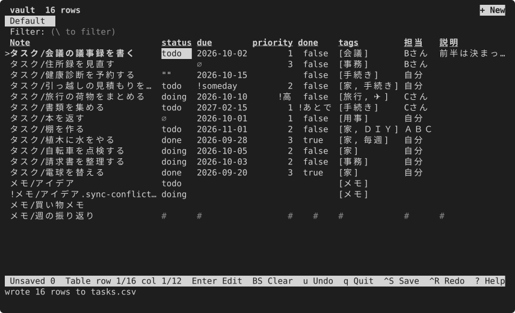

Print the table of a view to standard output without opening the screen (csv by default; notes are not written):

```sh
mdgrid /tmp/mdgrid-sample/タスク.base --print
mdgrid /tmp/mdgrid-sample/タスク.base --print --format json | jq .
mdgrid /tmp/mdgrid-sample --print --format md > table.md
mdgrid /tmp/mdgrid-sample --print --format tsv > table.tsv
```

When you `--print` a folder, there is no note-name column (the columns are the frontmatter keys only).

Pick rows on screen and print their paths or a column's values. The screen is read-only; `Enter` prints the marked rows (or the selected row) one per line and exits. `q` cancels, prints nothing and exits with status 1.

```sh
mdgrid /tmp/mdgrid-sample --pick path | xargs -o vi    # open the picked notes
mdgrid /tmp/mdgrid-sample --pick status
```

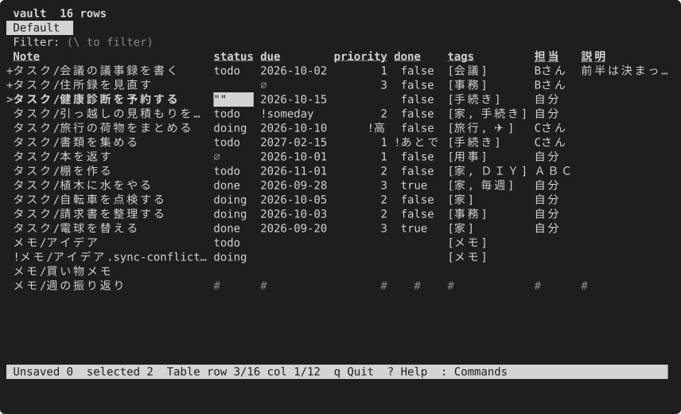

`y` (or `Ctrl+C`) copies the cell and `Y` the whole row to the clipboard.

## Choose a theme

Add a line such as `theme = "nord"` to the config to change the screen colors. All seven themes and how to choose them are on the [Themes](themes.md) page.

## When you cannot edit

| What you see | Why | What to do |
|---|---|---|
| a row of `#` cells | the note's frontmatter cannot be written safely (a duplicate key, a BOM, mixed line endings, …) | select it to see the reason; fix it in your editor (`e`). All reasons: [Read-only notes](../../safety.md#read-only-notes) |
| `Enter` says read-only | a nested value, a block scalar, a `file.*` or `formula.*` column | [Read-only values](../../safety.md#read-only-values) |
| a value with line breaks cannot be edited | the one-line input cannot hold it | open the note with `e` |
| a date or number is refused | the date does not exist, or the value is not a number | the input stays open; type it again |
| `!` at the start of a row | a conflict file made by a sync tool, or a note that changed on disk while you had pending changes | clean up conflict files by hand; for a changed note, write over it (`o`) or drop your changes (`d`) in the save review |
| nothing can be written | opened with `--readonly` | open again without it |

If a note changes on disk while mdgrid is open, mdgrid re-reads it automatically (not while you are editing a cell). If it changed before you save, the save review shows it.
