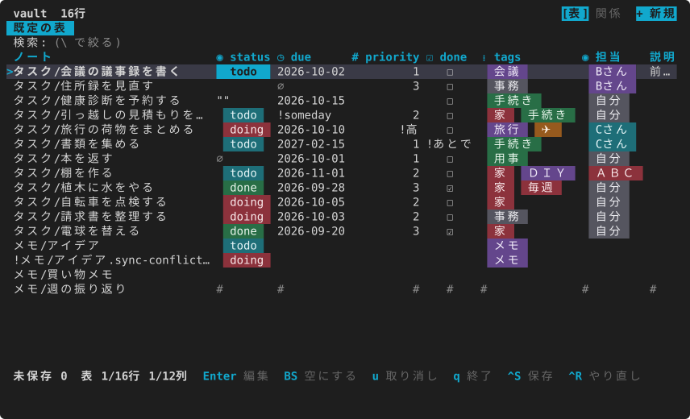

# mdgrid

[English](../en/index.md)

mdgrid は、フロントマター付きの Markdown のノートの集まりを、ターミナルの表で見て、その場で値を直す道具です。ノートが行に、フロントマターのキーが列に並びます。Obsidian の保管庫を Obsidian を開かずに扱え、Obsidian Bases の `.base` の table ビューも開けます。

こんな人に向きます:

- Obsidian などで、タスクや読書記録をフロントマターで管理している
- たくさんのノートの `status` や `due` を、エディタで1つずつ開かずにまとめて直したい
- 直すときに、ファイルのほかの部分(キーの順・コメント・本文)を崩されたくない

mdgrid は直したキーの値だけを書き(無いキーなら1行足し)、ほかのバイトは1バイトも変えません。書く前にはファイルごとの差分を見せて確かめます。

## 目次

- [はじめかた](getting-started.md) — 入れ方、見本での最初の起動、画面の見方、最初に使うキー
- [mdgrid の考え方](concepts.md) — 表・ビュー・保存・登録した表・リンク・ワークスペース・関係マップと、mdgrid が何をどこに置くか
- [作業の手引き](tasks.md) — 値を直して保存する、探して絞る、まとめて直す、新しいノートを作る、`.base` を開く、見せ方を保存する、フォルダを自分のコマンドにする、表を登録する、リンクで表をつなぐ、ワークスペースで表をまとめる、ほかのコマンドと組む
- [見た目を整える](appearance.md) — テーマ、セルを部品で見せるか文字で見せるか、枠、表のまわりに出すもの、端末と字の形
- [困ったとき](faq.md) — セルの印、直せないセル、`?` の付くリンク、関係マップ、列のずれ、色、速さ

## 参照

決まりの一覧は、試験で中身を確かめている参照のページにあります。

- [キーの割り当て](../../keys.ja.md) — モードごとの全部のキーと、割り当て直し
- [設定](../../config.ja.md) — 設定のファイルの全項目
- [書き戻しの安全](../../safety.ja.md) — 何を書き、何を書かないか、読むだけになるノートとその理由
- [Obsidian Bases の対応範囲](../../obsidian-bases.ja.md) — `.base` のうち解釈するもの・しないもの
- [テーマ](themes.md) — 7つの色の組み合わせの見本と選び方
- [画面の一覧](shots.md) — 全部の画面のスクリーンショット
