# mdgrid の使い方

フロントマター付きの Markdown のノートを、ターミナルの表で見て直す。画面は見本の保管庫(examples/vault)。

<!-- generated by app-manual/tui_shot.py: the screenshot gallery. The manual's chapters link to images/. -->

## フォルダを開く

ノートが行に、フロントマターのキーが列に並ぶ。上に検索の欄、下に今押せるキーが出る。

## 値を選んで直す

キー: `Enter`

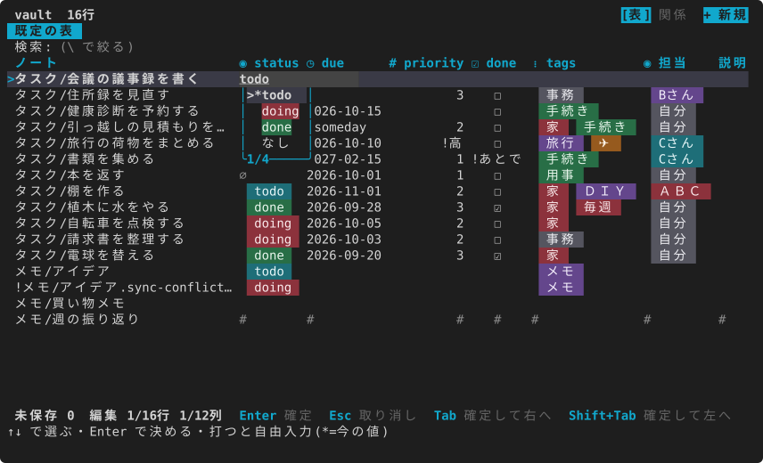

status のセルで Enter。同じ列のほかのノートの値から選べる。打てば今の値を置き換えて自由入力になる。

## 打って候補を絞る

キー: `Enter` `d` `o`

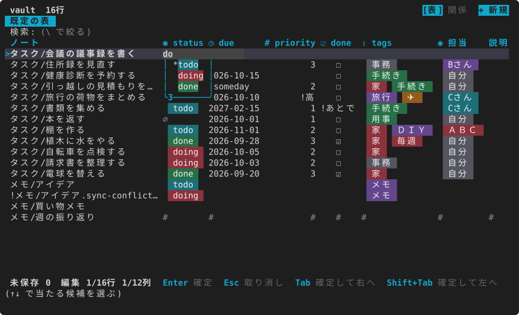

リストで打つと、打った文字を含む候補だけが残る(まだ何も選んでいない)。↓・↑ で候補を選び、そのまま Enter なら打った文字を書く。

## 日付をカレンダーで入れる

キー: `l` `Enter`

日付の列ではカレンダーが開く。矢印で日を動かし、Enter で決める。

## タグを付け外しする

キー: `l` `l` `l` `l` `Enter`

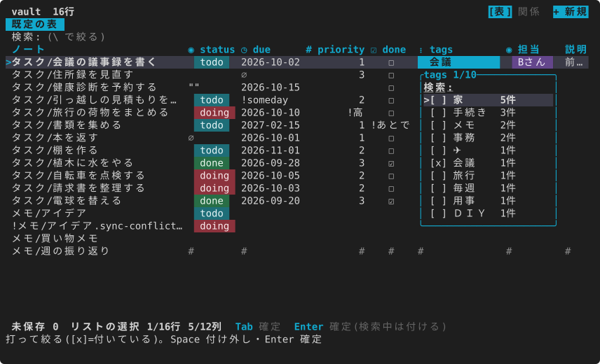

リストの列では、保管庫にある値の一覧から付け外しする。

## 差分を見てから保存する

キー: `Enter` `Down` `Enter` `C-s`

直した値はすぐには書かない。Ctrl+S でファイルごとの差分を見て、確かめてから書く。直したキーの値の外は1バイトも変えない。

## 保存したあと

キー: `Enter` `Down` `Enter` `C-s` `Enter`

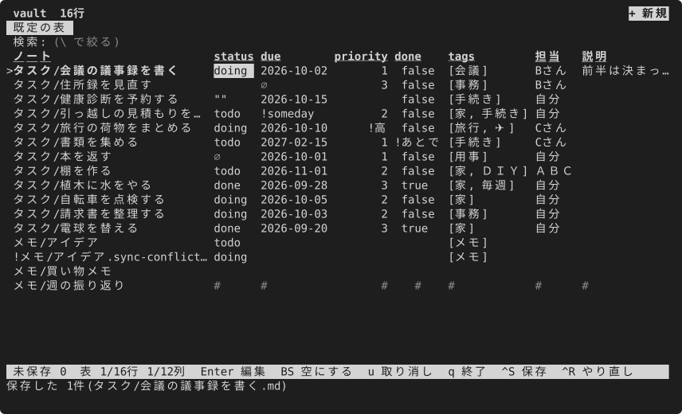

保存の確認で Enter を押すと書く。未保存は 0 に戻り、書いたファイルの数が出る。

## ヘルプ

キー: `?`

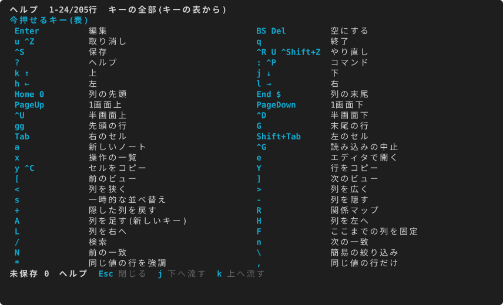

? で全部のキーの一覧。設定で割り当て直せる(docs/keys.md)。

## コマンドのパレット

キー: `:`

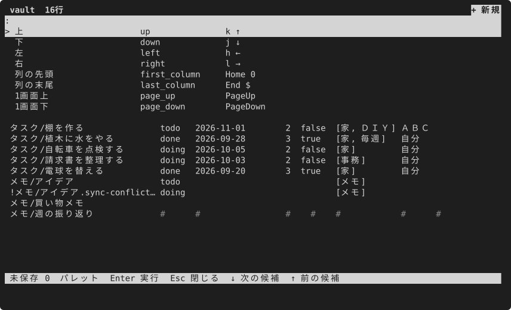

: で、名前で探して動作を選べる。

## ビューの設定

キー: `o`

o で列・フィルター・並べ替え・グループを決め、mdgrid のビューとして保存できる。

## 新しいノートを作る

キー: `a`

a か右上の「+ 新規」で、名前を打って新しいノートを作る。

## 作ったノート

キー: `a` `text:電話をかける` `Enter`

名前を打って Enter で、すぐにファイルができる。作った行が選ばれ、そのまま値を入れられる。

## コマンドを名前で探す

キー: `:` `text:save`

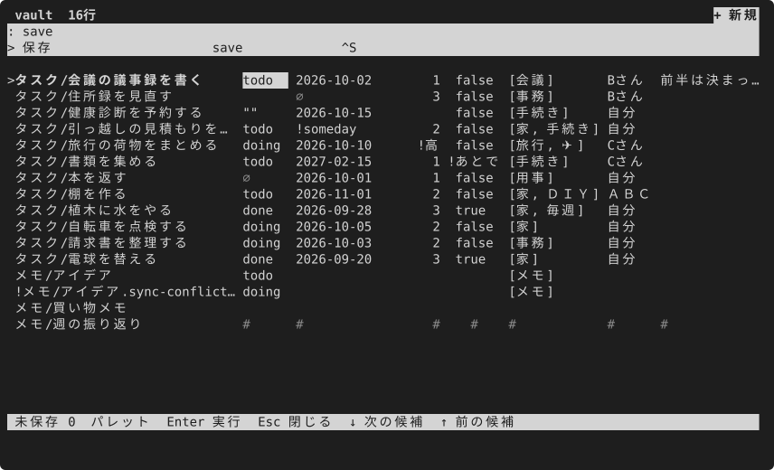

名前の一部を打つと候補が絞られ、横に割り当てキーが出る。

## その場の操作の一覧

キー: `x`

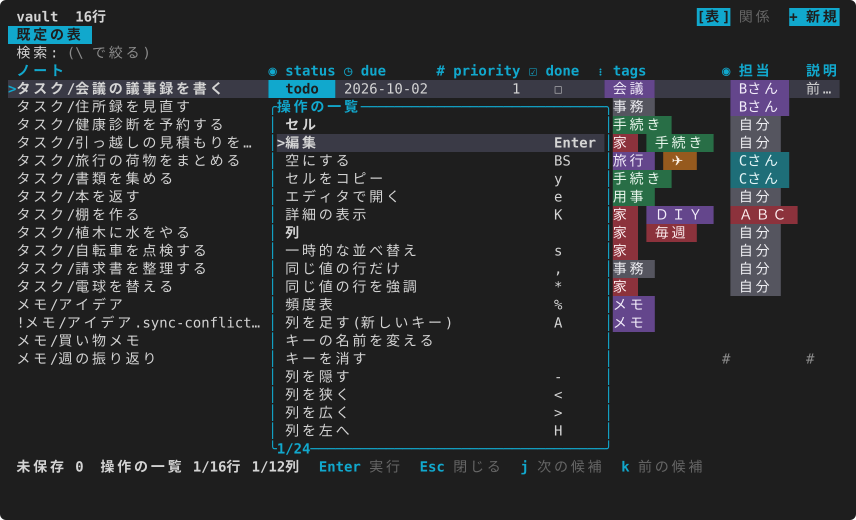

x か右クリックで、選んでいるセルで今できる操作が、セル・列・行・ビューとファイルの節に分かれ、キーを添えて並ぶ。↑↓ と Enter か、添えたキーで実行する。Esc で閉じる。

## 前置きのキーの続き

キー: `g`

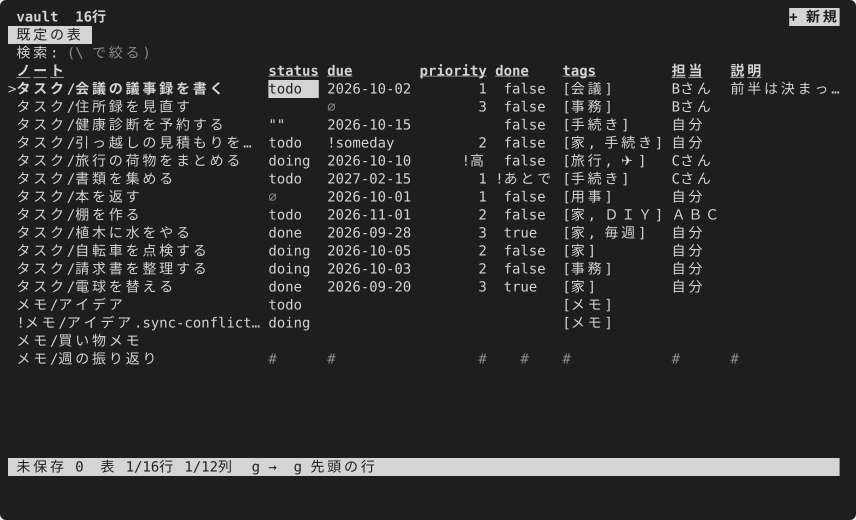

g のような前置きのキーを押すと、下の帯に続けて押せるキーが出る。Esc で前置きを取り消す。

## .base を開く

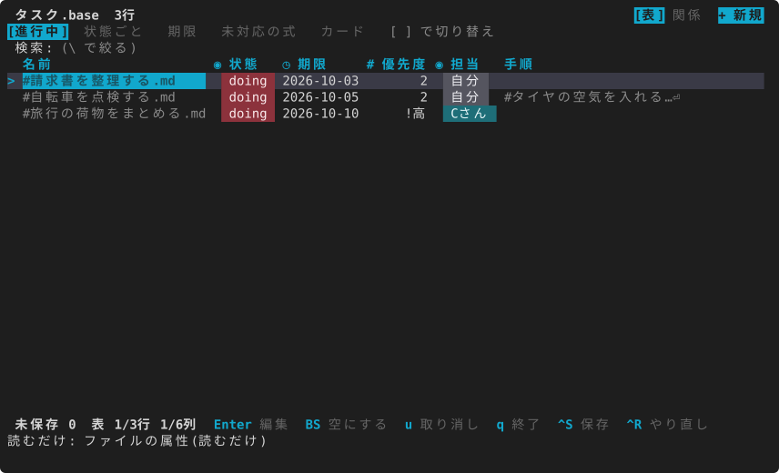

.base の table ビューがタブに並び、先頭が開く。列の見出しは displayName。

## ビューを切り替える(グループ)

キー: `]`

] と [ でビューを切り替える。このビューは status ごとに見出しの行で分かれる。

## まとまりを畳む

キー: `]` `Enter`

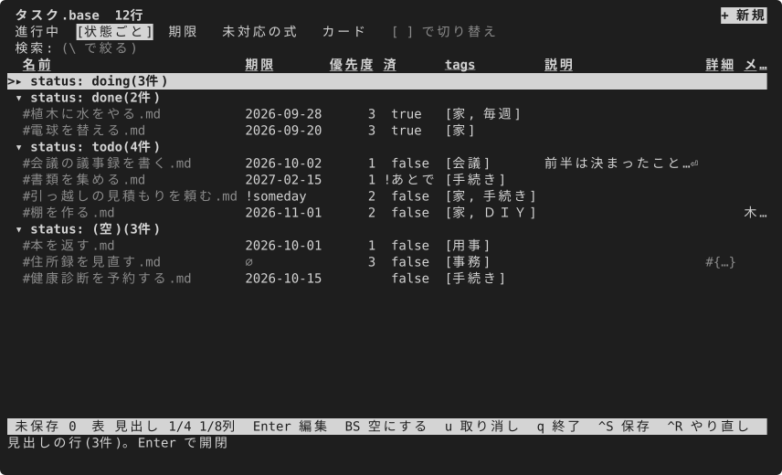

見出しの行で Enter を押すと、そのまとまりを畳む・開く。

## 評価できない式

キー: `l` `l`

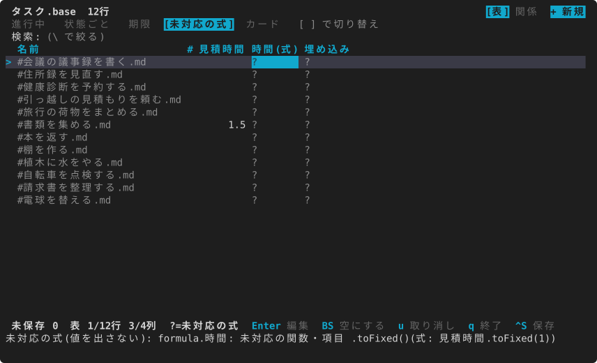

評価できない式の列は推測せず薄い ? を出す。選ぶと下にどの式かが出る。

## table 以外のビュー

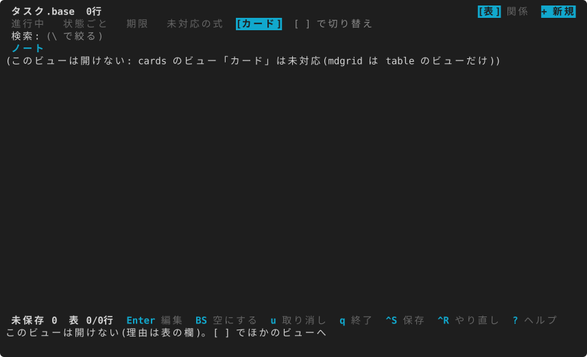

mdgrid は table のビューだけ。ほかの型は開かずに理由を出す。

## 同期の競合ファイル

キー: `:` `text:14` `Enter`

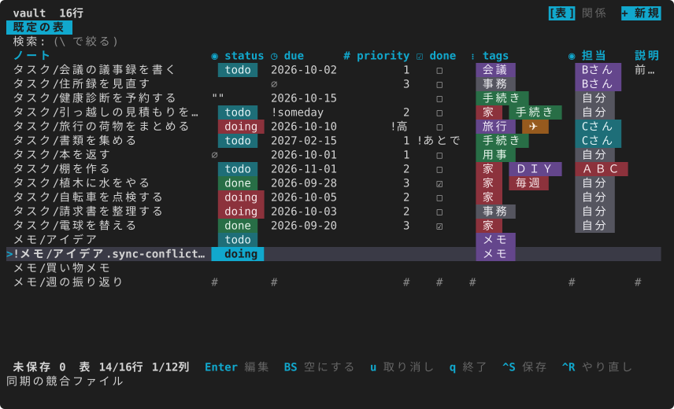

同期の道具が作った競合ファイルには ! が付く。手で片付ける。

## 空・null・キーなし・型の不一致

キー: `j` `j` `j` `l`

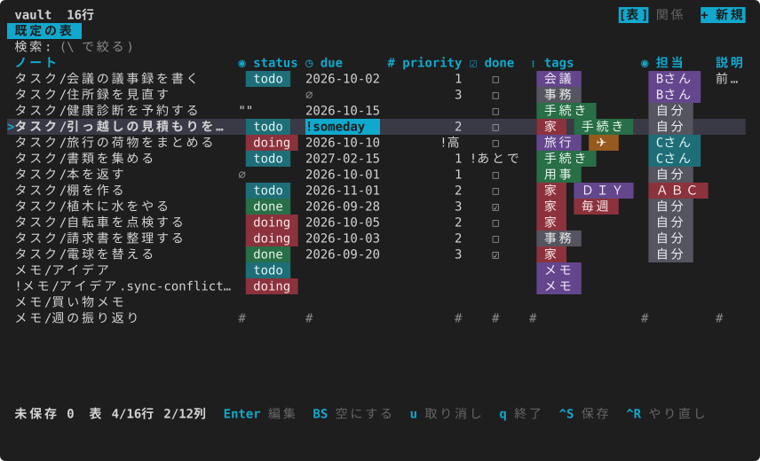

∅ は null、"" は空の文字列、空欄はキーなし。! は列の型に合わない値(日付の列の someday)。

## 1つのノートの詳細

キー: `K`

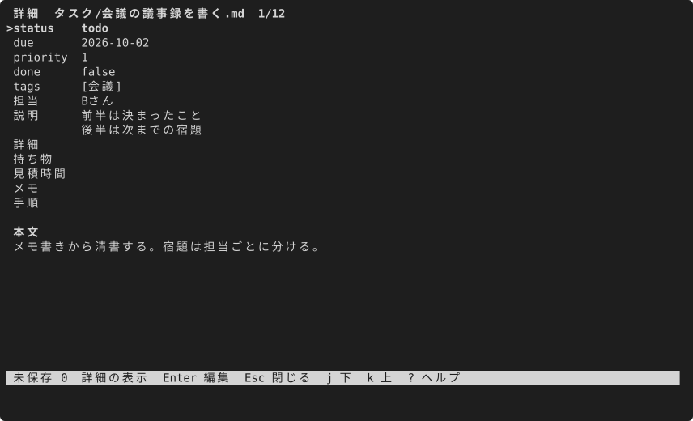

K で全部のプロパティを縦に並べる。長い値も折り返して全文。Enter で編集。

## 色なしで

キー: `Backspace`

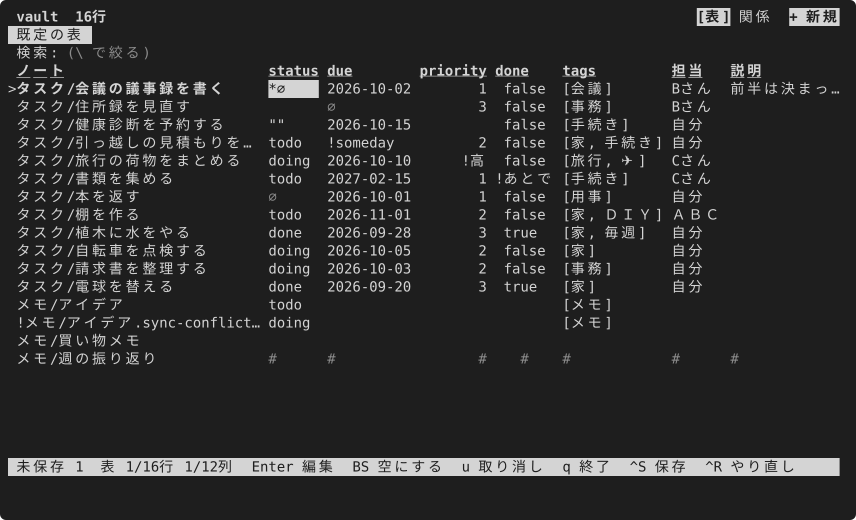

NO_COLOR や --no-color でも、ためた変更などは * のような印で見分けられる。

## 行番号へ移動

キー: `:` `text:14`

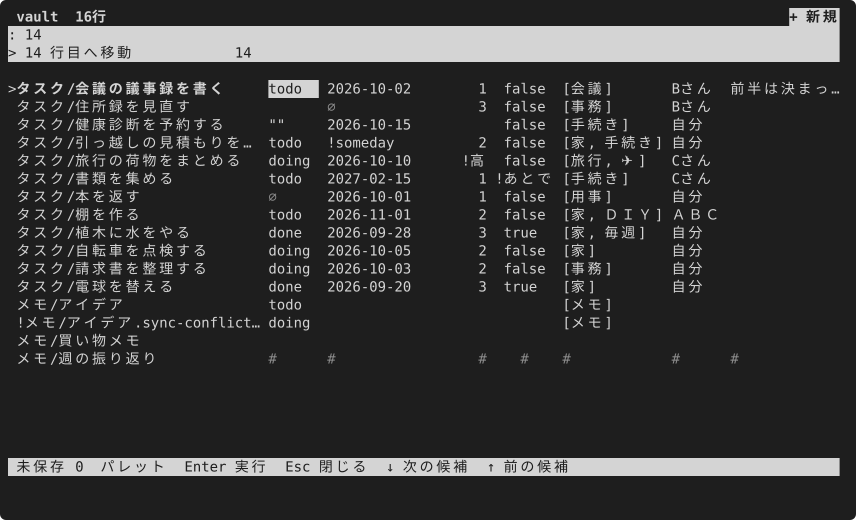

パレットで番号を打って Enter で、その行へ移る。

## 検索

キー: `/` `text:doing` `Enter`

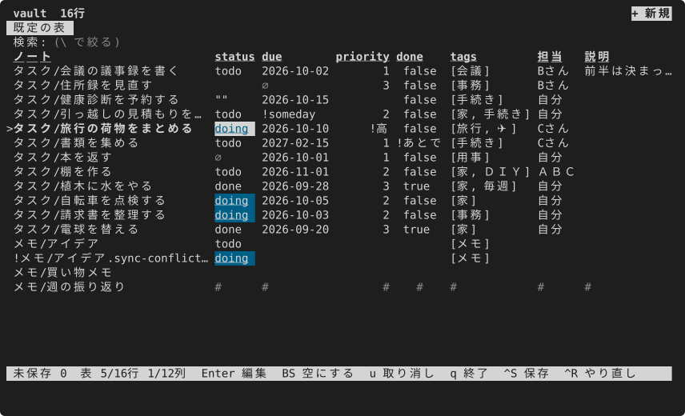

/ で一致をすべて強調し、n・N で移る。小文字だけの語は大文字小文字を区別しない。

## 簡易の絞り込み

キー: `\` `text:家`

\ で上の欄に入り、打つたびに行が絞られ件数が出る。Esc で解除。

## 同じ値の行だけ

キー: `,`

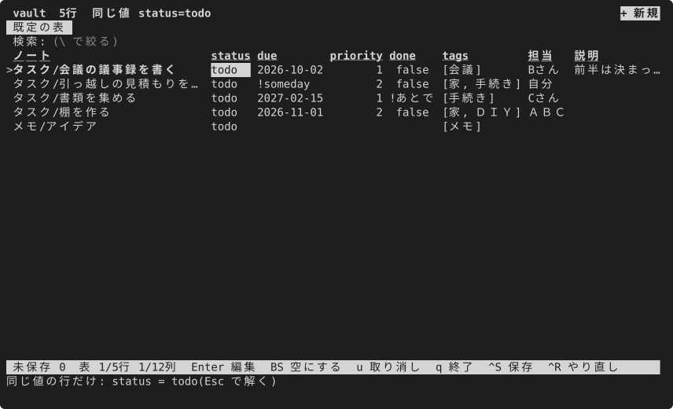

, で選んだセルと同じ値の行だけにする。* は強調だけ。

## 一時的に並べ替える

キー: `l` `s`

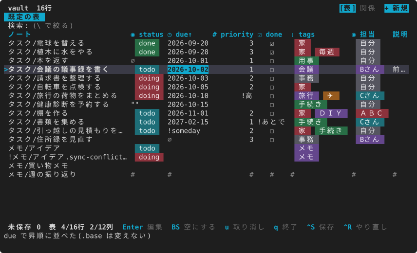

s で 昇順 → 降順 → 解除。.base は変えない。

## 列を隠す

キー: `l` `-`

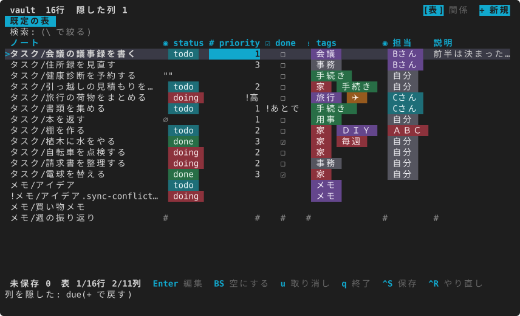

- で隠し、+ で戻す。H・L で列を動かし、<・> で幅を変える。

## 列を足す

キー: `A` `r` `e` `v` `i` `e` `w` `e` `r` `Enter`

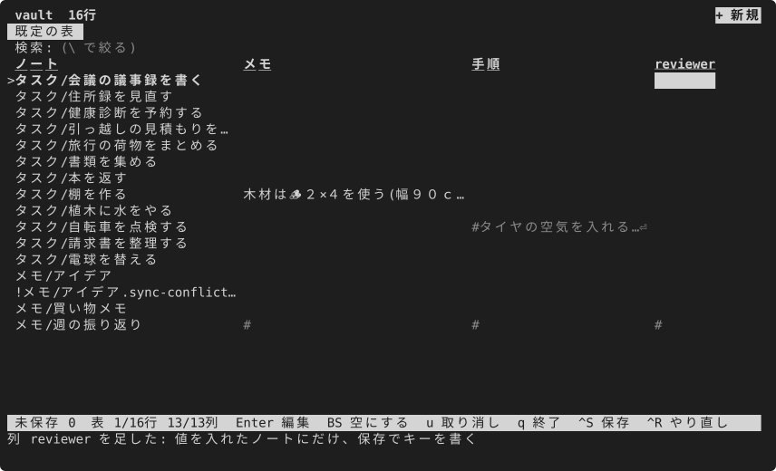

A で、まだどのノートにも無いキーの列を足す。保存では、値を入れたノートにだけキーを書く。

## 列を固定する

キー: `l` `F` `End`

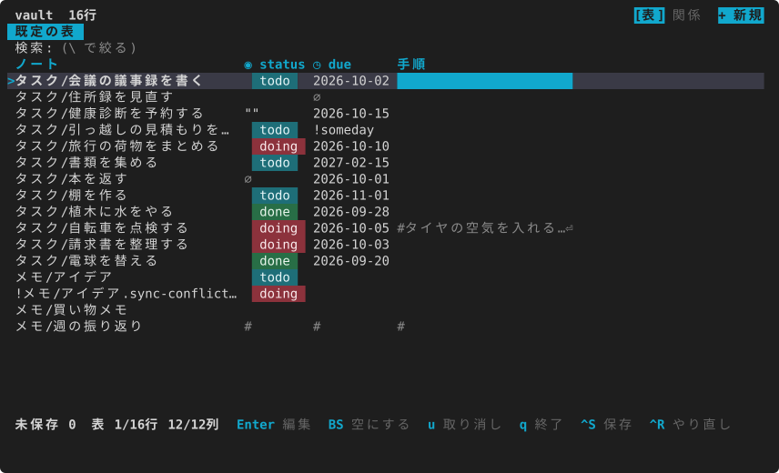

F で選んだ列までを固定し、右へ流しても見えたままにする。

## 行に印を付ける

キー: `Space` `Space` `Space`

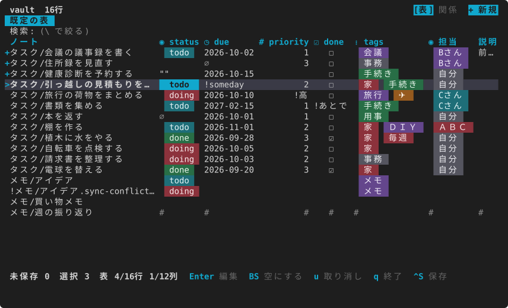

Space で印を付けて下へ。v で範囲、Ctrl+A で全部、Esc で解く。

## 新しい値を打つ

キー: `Enter` `text:waiting`

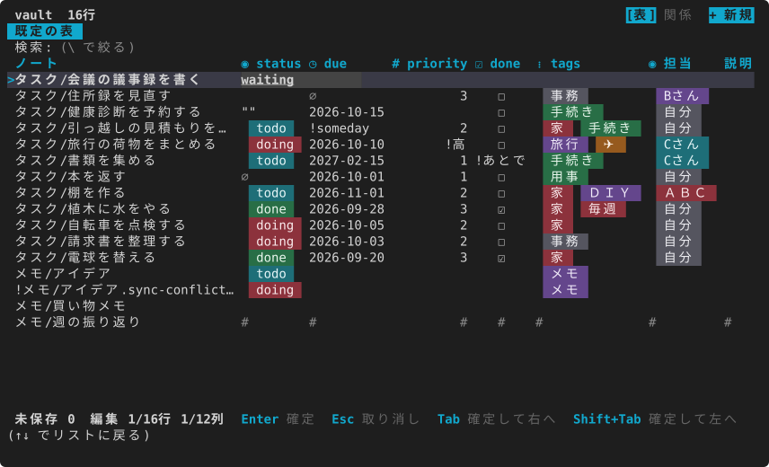

リストで打つと、今の値を置き換えて自由入力になる(今の値を直すには先に ← か BS)。Enter で確定、Esc で取り消し、Tab で確定して右へ。

## チェックボックスを切り替える

キー: `l` `l` `l` `Enter`

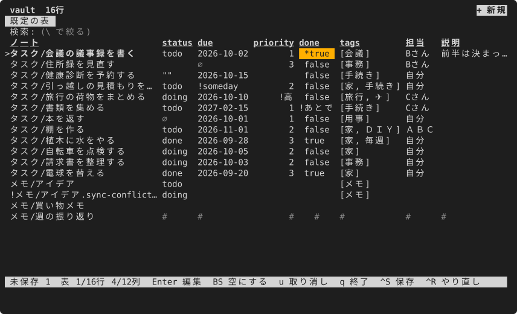

Enter で true と false を切り替える(空のセルは true に。空にするのは BS)。保存までは書かない。

## 日付は確かめられる

キー: `l` `Enter` `Backspace` `Backspace` `Backspace` `Backspace` `Backspace` `Backspace` `Backspace` `Backspace` `Backspace` `Backspace` `text:2026-02-30` `Enter`

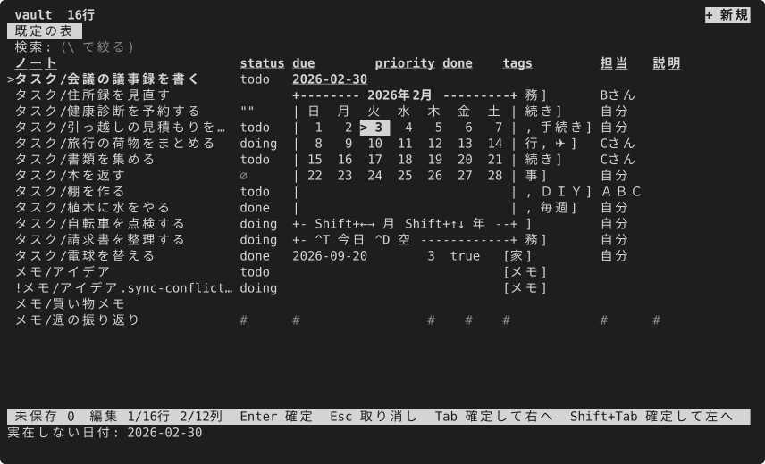

実在しない日付は受け付けず、入力は開いたまま。+3 は今日から3日後。

## 数の列は数だけ

キー: `l` `l` `Enter` `text:a` `Enter`

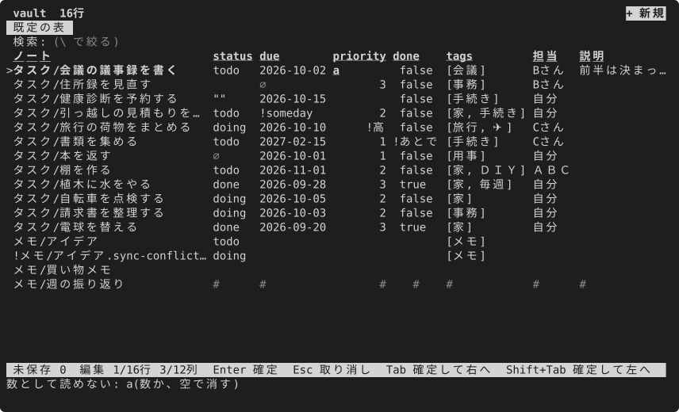

数の列は数として読める値だけを受け付ける。

## セルを空にする

キー: `Backspace`

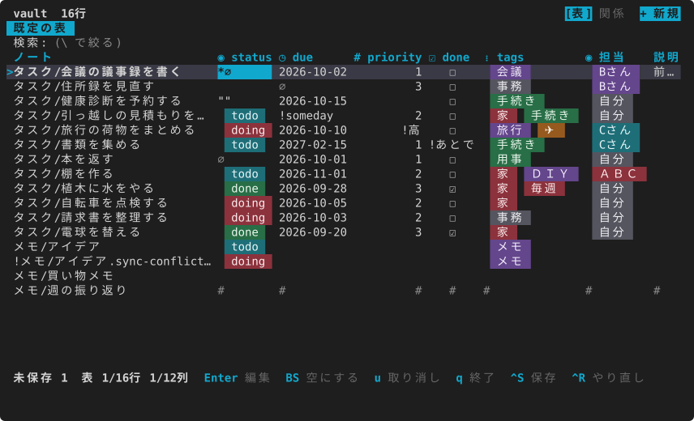

Backspace か Delete で空にする。保存すると `key:` と書かれ、キーは残る。

## 型の合わない値を直す

キー: `j` `j` `j` `l` `Enter`

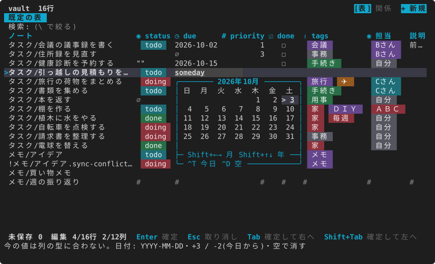

型の合わない値のセルは列の型の入力で開き、カレンダーは今日の月を出す。

## 複数の行にまとめて入れる

キー: `Space` `Space` `Space` `k` `Enter`

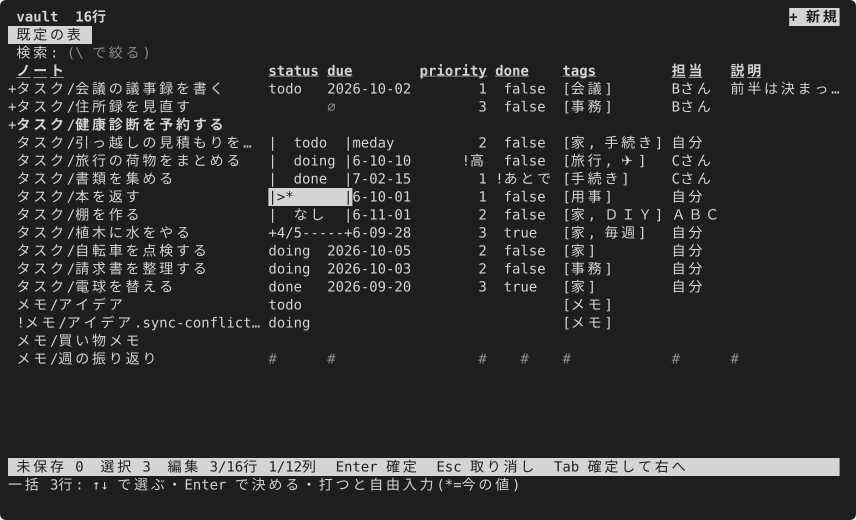

印を付けた行に同じ値を入れる。入れられない行は飛ばし、数と理由を出す。

## 複数の行のリストを付け外し

キー: `l` `l` `l` `l` `Space` `Space` `Space` `k` `Enter`

[x] は全部の行、[-] は一部の行が持つ。各行のほかの要素は残る。

## 直した行はその場に残る

キー: `l` `Enter` `Backspace` `Backspace` `Backspace` `Backspace` `Backspace` `text:todo` `Enter`

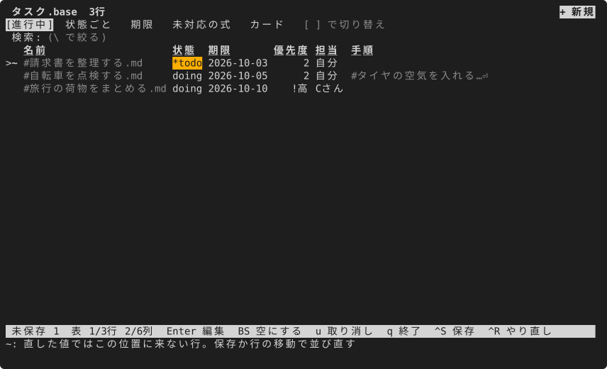

doing だけのビューで todo に直しても、保存か移動まで行は残る。

## フロントマターの無いノート

キー: `G` `k` `Enter` `text:todo` `Enter` `C-s`

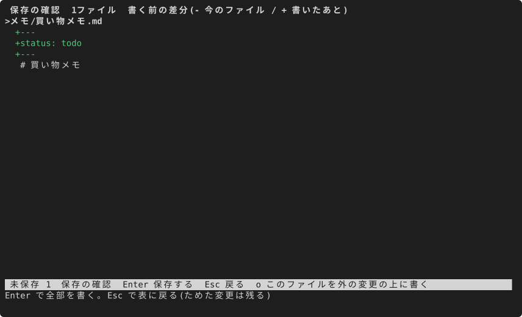

フロントマターの無いノートに書くと、先頭に --- の区切りと行が足される。本文は変わらない。

## 直せないセル

キー: `j` `l` `l` `l` `l` `l` `l` `l` `Enter`

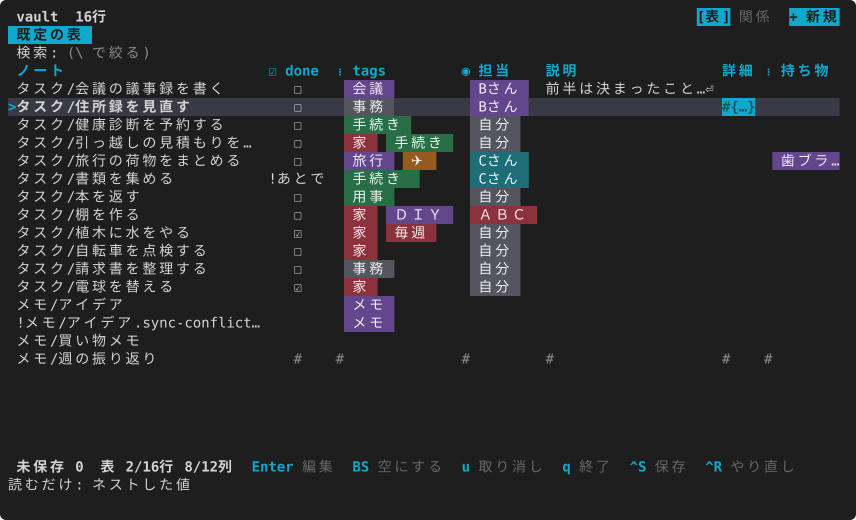

ネストした値・ブロックスカラー・file.* と formula.* の列などは読むだけで、Enter で理由が出る。

## 改行を含む値

キー: `l` `l` `l` `l` `l` `l` `Enter`

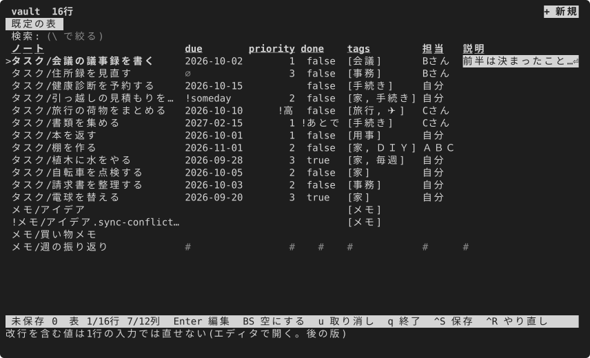

改行を含む値は1行の入力では直せない。e でノートをエディタで開く。

## 設定の日付の形と週の始まり

キー: `l` `l` `Enter`

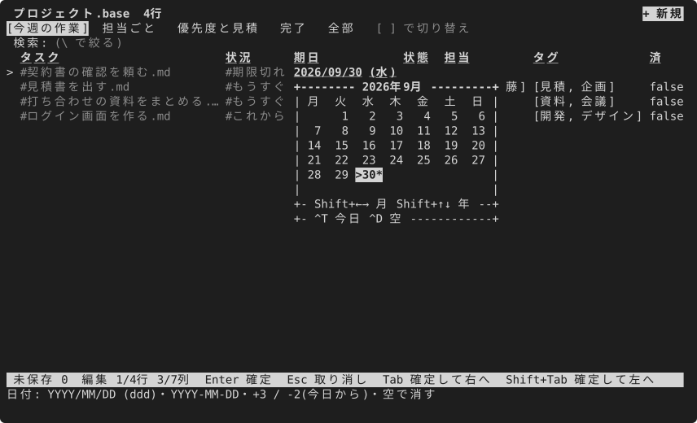

見本の設定は date_format = "YYYY/MM/DD (ddd)"・week_start = "mon"。ノートには YYYY-MM-DD で書く。

## 未保存のまま終わる

キー: `Backspace` `q`

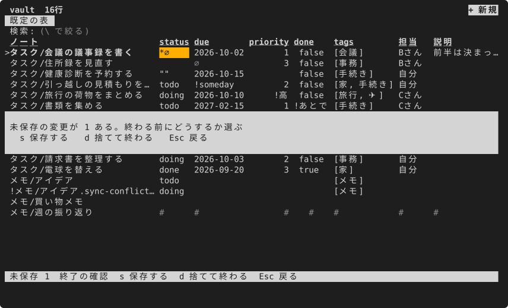

s で保存、d で捨てて終わる、Esc で戻る。

## 読むだけで開く

キー: `Enter`

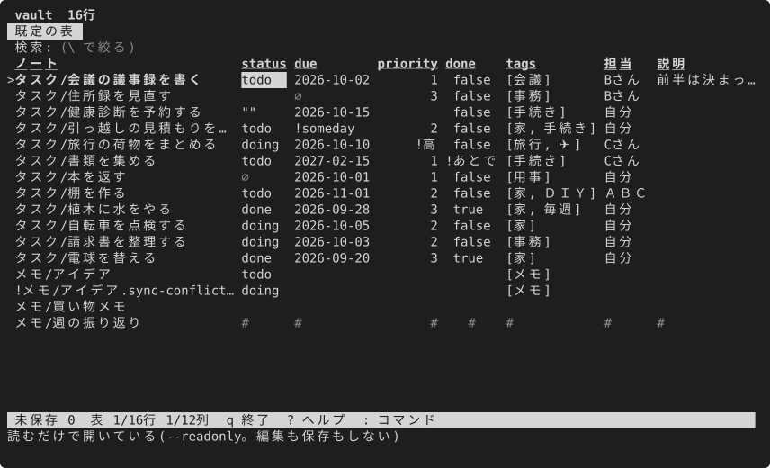

--readonly では何も書かない。編集・保存・新しいノートができず、ビューの設定も覚えない。

## 値を選んで絞る

キー: `o` `Enter` `Enter` `Enter` `Down` `Down` `Down` `Space`

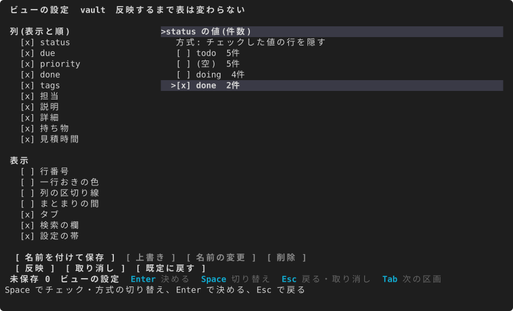

列を選び、残す・隠す値にチェックを付ける。件数が添えられ、キーの無いノートは「(空)」。

## 設定の帯

キー: `o` `Enter` `Enter` `Enter` `Down` `Down` `Down` `Space` `Enter` `Tab` `Tab` `Tab` `Tab` `Enter` `f`

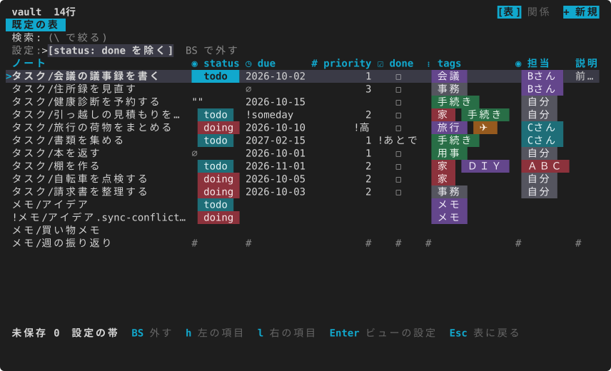

効いている条件が表の上に並ぶ。f で帯に入り、Backspace で外す。

## 行番号と列の区切り線

キー: `o` `Tab` `Tab` `Tab` `Space` `Down` `Down` `Space` `Tab` `Enter`

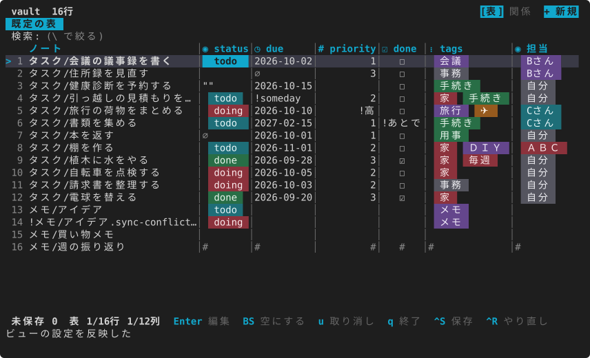

「表示」の節で、このビューの行番号・一行おきの色・列の区切り線を切り替える。

## mdgrid のビューとして保存

キー: `o` `Tab` `Tab` `Tab` `Tab` `Down` `Down` `Down` `Enter` `text:mine` `Enter`

今の見せ方に名前を付けて保存すると、「既定の表」の横のタブになり、views.toml に残る。

## 新しい .base に書き出す

キー: `:` `text:export_base` `Enter`

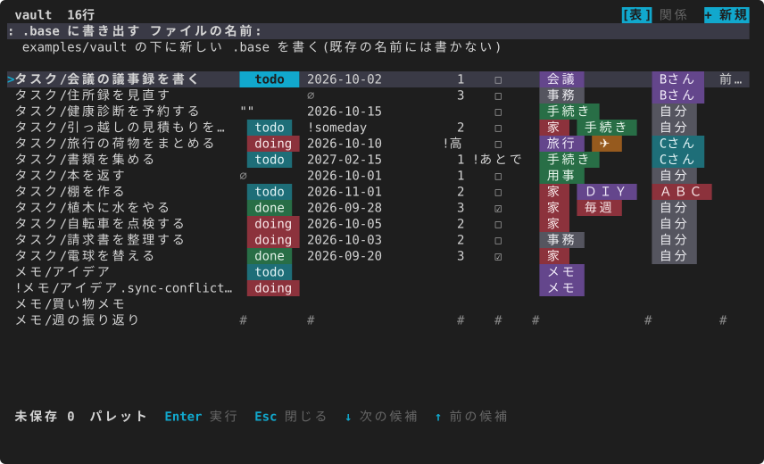

名前を決めて新しい .base に書く。既存の .base は書き換えない。

## .base のビューを取り込む

キー: `:` `text:import_base` `Enter`

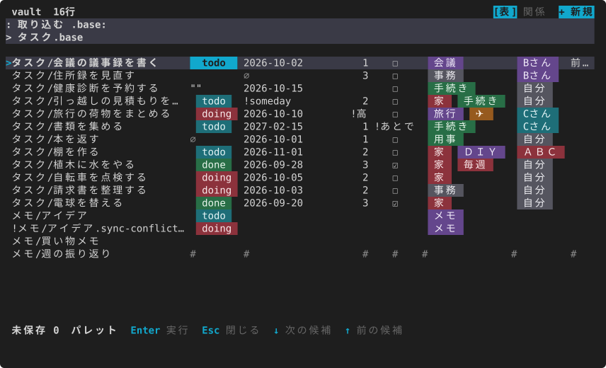

.base とそのビューを選んで、mdgrid のビューとして写す。

## 取り込んだビュー

キー: `:` `text:import_base` `Enter` `Enter` `Enter`

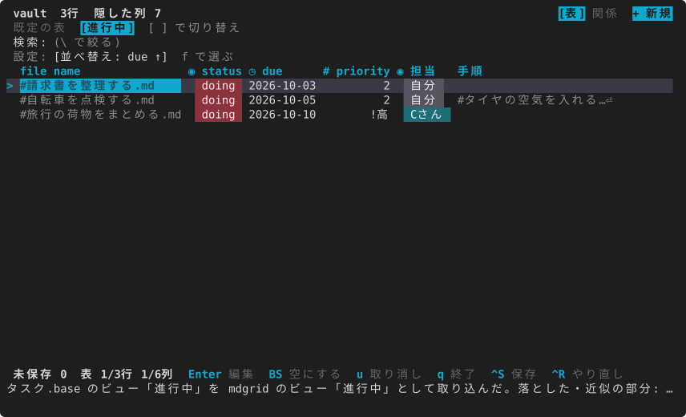

ビューがタブに増える。持てない部分(formulas・limit・displayName)は落とした項目として出る。

## 絞ったビューで作る

キー: `a`

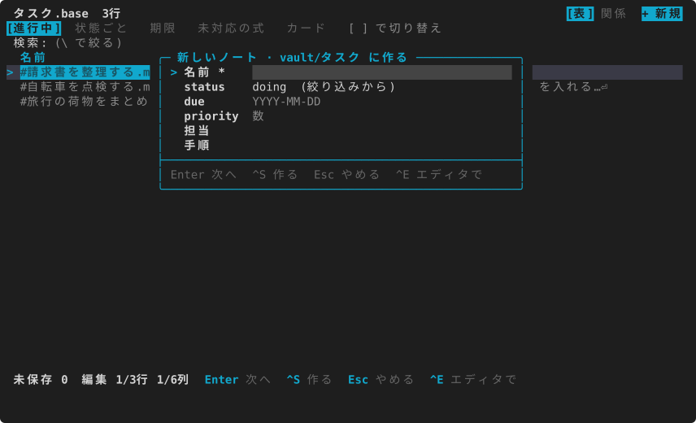

status == "doing" で絞ったビューで作ると、status: doing が入り、そのビューに残る。

## 作る場所を選ぶ

キー: `a`

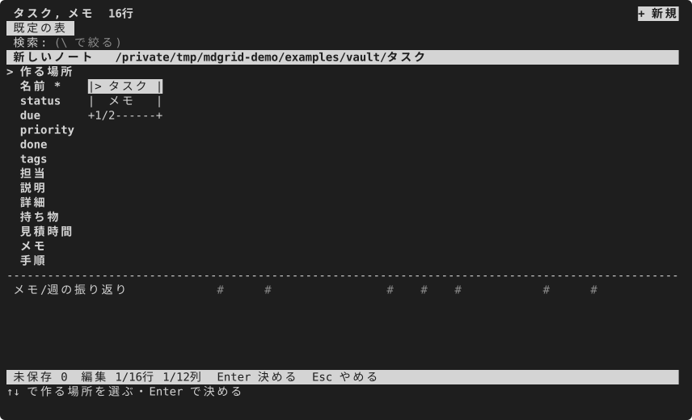

フォルダを2つ以上開いたときは、先に作る場所を選ぶ(最初のフォルダが選ばれている)。

## 行を選んでほかのコマンドに渡す

キー: `Space` `Space`

--pick は読むだけで開き、Enter で印を付けた行のパスを1行ずつ出して終わる。q で取りやめ。

## 設定の見本

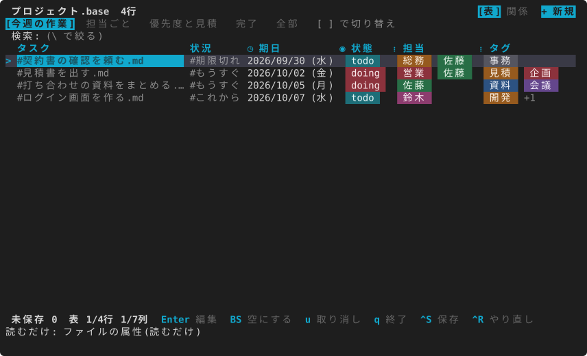

examples/showcase/config.toml は日付の形を変え、Ctrl+F を検索に割り当てる。--config で渡して開く。

## 読むだけのノート

キー: `G` `Enter`

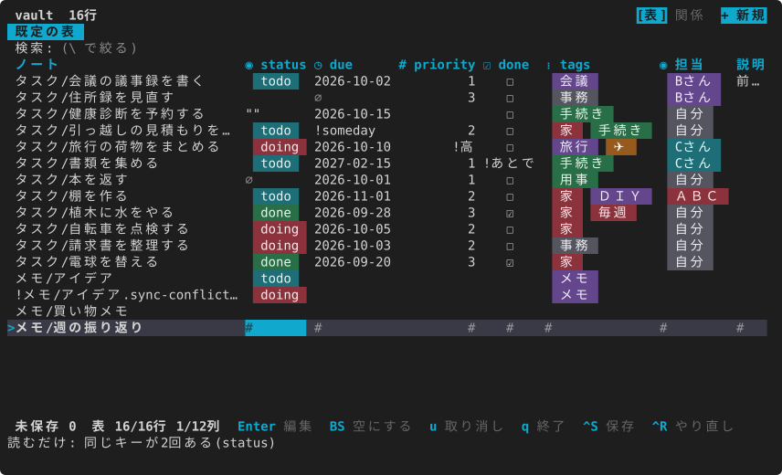

安全に書けないノート(ここではキーの重複)は表に出るが読むだけで、理由が出る。

## テーマ: Nord

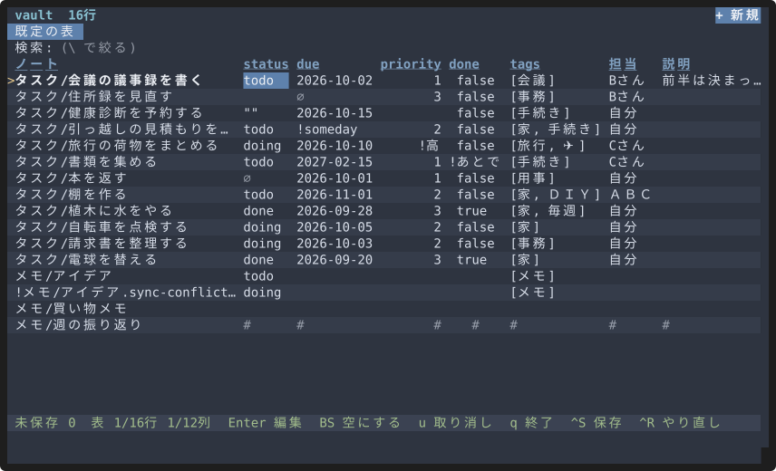

theme = "nord"(落ち着いた青)。変わるのは色だけで、* や > などの印はそのまま。

## テーマ: Solarized Light


theme = "solarized-light"(明るい地)。変わるのは色だけで、* や > などの印はそのまま。

## テーマ: Dracula


theme = "dracula"(紫と桃のアクセント)。変わるのは色だけで、* や > などの印はそのまま。

## テーマ: Gruvbox


theme = "gruvbox"(暖かい茶と橙)。変わるのは色だけで、* や > などの印はそのまま。

## テーマ: Pink Monster


theme = "pink-monster"(濃い赤紫の地に蛍光の桃と黄緑)。変わるのは色だけで、* や > などの印はそのまま。

## テーマ: Dozy Pink


theme = "dozy-pink"(淡い桃とクリーム)。変わるのは色だけで、* や > などの印はそのまま。

## 仕事の一覧の .base のビュー


examples/demo/Tasks.base。table ビューが4つタブに並ぶ。Open は済んだ仕事を隠し、期限の順に並べる。表の下の行は見積もりの合計と一番早い期限。

## status を選ぶ

キー: `Enter`

status のセルで Enter。ほかのノートの値から選べる。

## 期限を選ぶ

キー: `l` `Enter`


日付の列ではカレンダーが開く。

## 差分を見てから保存する

キー: `Enter` `Down` `Enter` `C-s`


Ctrl+S で、ファイルごとに変わるところだけを見せる。

## status ごとのまとまり

キー: `]`

By status のビューは見出しの行でまとめ、Enter で畳める。

## その場の操作の一覧

キー: `x`


x か右クリックで、ここでできる操作がキーを添えて並ぶ。

## テーマ Nord


設定に theme = "nord"。テーマは7つある。

## Demo frame 1

Frame of the demo GIF.

## Demo frame 2

キー: `Enter`


Frame of the demo GIF.

## Demo frame 3

キー: `Enter` `Down`


Frame of the demo GIF.

## Demo frame 4

キー: `Enter` `Down` `Enter`


Frame of the demo GIF.

## Demo frame 5

キー: `Enter` `Down` `Enter` `l` `Enter`


Frame of the demo GIF.

## Demo frame 6

キー: `Enter` `Down` `Enter` `l` `Enter` `Right` `Right` `Right`


Frame of the demo GIF.

## Demo frame 7

キー: `Enter` `Down` `Enter` `l` `Enter` `Right` `Right` `Right` `Enter`


Frame of the demo GIF.

## Demo frame 8

キー: `Enter` `Down` `Enter` `l` `Enter` `Right` `Right` `Right` `Enter` `C-s`


Frame of the demo GIF.

## Demo frame 9

キー: `Enter` `Down` `Enter` `l` `Enter` `Right` `Right` `Right` `Enter` `C-s` `Enter`


Frame of the demo GIF.

## Demo frame 10

キー: `Enter` `Down` `Enter` `l` `Enter` `Right` `Right` `Right` `Enter` `C-s` `Enter` `]`


Frame of the demo GIF.

## Demo frame 11

キー: `Enter` `Down` `Enter` `l` `Enter` `Right` `Right` `Right` `Enter` `C-s` `Enter` `]` `x`


Frame of the demo GIF.

## 列の値を数える

キー: `l` `l` `l` `%`


% で列の値ごとの件数と割合が出る。Enter でその値の行だけに絞る。

## 日時の時刻を選ぶ

キー: `l` `Enter` `Ctrl+O` `↑`

日時の列では、カレンダーの下に時刻の欄が出る。Ctrl+O で時刻の欄に移り、↑↓ で15分、Shift+↑↓ で1時間動かす。

## 表をファイルに書き出す

キー: `:` `export_table` `Enter` `tasks.csv` `Enter`

パレットから、今見えている表(絞り込み・並べ替え・隠した列を当てたもの)を書き出す。形は拡張子(.csv・.tsv・.json・.md)で決まる。先頭の列は各ノートのパスなので、CSV と JSON は --apply で戻せる。
