# 作業の手引き

[English](../en/tasks.md) · [目次](index.md)

- [値を直して保存する](#値を直して保存する)
- [探す・絞る・並べる](#探す絞る並べる)
- [まとめて直す](#まとめて直す)
- [新しいノートを作る](#新しいノートを作る)
- [.base を開く](#base-を開く)
- [見せ方を決めて保存する](#見せ方を決めて保存する)
- [フォルダを自分のコマンドにする](#フォルダを自分のコマンドにする)
- [ほかのコマンドと組む](#ほかのコマンドと組む)
- [テーマを選ぶ](#テーマを選ぶ)
- [直せないとき](#直せないとき)

例の `mdgrid` は、ビルドした `target/release/mdgrid` のこと。`/tmp/mdgrid-sample` は [はじめかた](getting-started.md#見本の保管庫で開く) で写した見本の保管庫。

## 値を直して保存する

1. セルを選んで `Enter` を押す。入力は列の型で変わる。
   - テキスト: 同じ列のほかのノートの値から選ぶ(値の種類が設定の `candidates`、既定 20 以下のとき。多ければ打つだけ)。打てば自由入力になる。
   - 日付: カレンダーが開く。`←` `→` で日、`↑` `↓` で週、`PageUp`・`PageDown` で月を動かす。`2026-10-15` のように打っても、`+3`(今日から3日後)でもよい。`Ctrl+T` で今日。
   - 日時: 同じカレンダーの下に時刻の欄が出る。`Ctrl+O` で時刻の欄に移り、`↑` `↓` で15分、`Shift+↑` `Shift+↓` で1時間動かす。日だけを変えれば各ノートの時刻はそのまま。`2026-10-15T09:30` と打ってもよい。
   - リスト(`tags` など): 保管庫にある値の一覧から付け外しする。
   - チェックボックス: `Enter` のたびに 空 → true → false → 空 と回る。
   - 数: 数として読める値だけを受け付ける。
2. `Enter` で確定する。`Esc` で取りやめ、`Tab` で確定して右のセルへ。
3. 直したセルには印が付き、下の帯の「未保存」が増える。この時点ではまだ書いていない。`u` で取り消し、`Ctrl+R` でやり直せる。
4. `Ctrl+S`(か `:w`)で保存の確認を開く。ファイルごとに、書く前と後の差分が出る。
5. `Enter` で全部を書く。`Esc` なら書かずに表に戻り、ためた変更は残る。

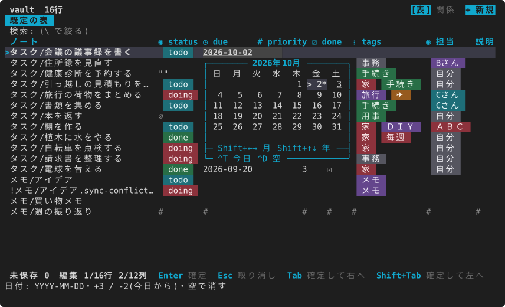

日時の列では、カレンダーの下に時刻の欄が出ます(写しは見本 `examples/schedule`)。`Ctrl+O` で時刻の欄に移り、`↑` `↓` で15分、`Shift+↑` `Shift+↓` で1時間動かします。

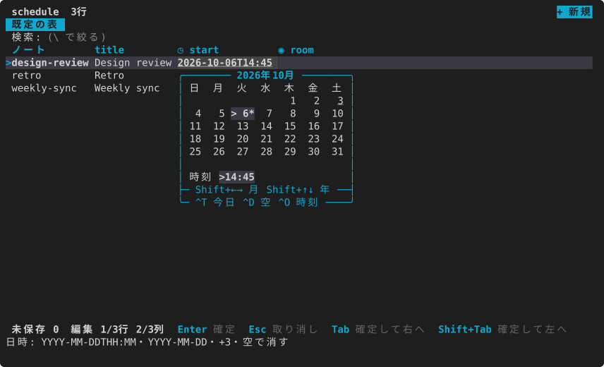

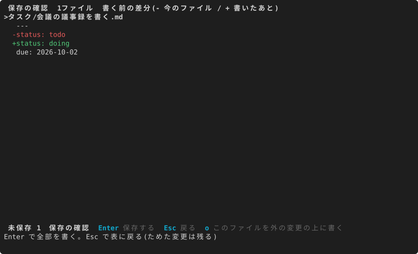

- セルを空にするには `Backspace` か `Delete`。保存すると `key:` と書かれ、キーは残る。
- 未保存のまま `q` を押すと、`s` で保存して終わる・`d` で捨てて終わる・`Esc` で戻る、を選ぶ。
- 1つのノートのプロパティを全部見るには `K`(詳細の表示)。長い値も全文で出て、`Enter` で直せる。
- ノートの本文や改行を含む値は、`e` でエディタで開いて直す。戻ると読み直す。エディタは設定の `editor`(無ければ `$VISUAL`、`$EDITOR`、`vi` の順)。

mdgrid が書くのは直したキーの値だけです。無いキーは1行足し、フロントマターの無いノートには先頭にフロントマターを足します(本文は変えない)。保存の前にノートが外で変わっていたら、確認の画面でそれを示し、上に書くか(`o`)を選ばせます。詳しくは [書き戻しの安全](../../safety.ja.md)。

## 探す・絞る・並べる

| したいこと | キー |
|---|---|
| 語を探して強調し、一致を移る | `/` で打って `Enter`、`n`・`N` |
| 語を含む行だけにする | `\` で打つ(打つたびに絞られ、件数が出る)。`Esc` で解く |
| 選んだセルと同じ値の行だけにする | `,`(`*` なら強調だけ) |
| この列で一時的に並べ替える | `s`(昇順 → 降順 → 解除) |
| 行番号へ飛ぶ | `:` で番号を打って `Enter` |
| 列を隠す・戻す | `-`・`+` |
| 列を動かす・幅を変える | `H`・`L`、`<`・`>` |
| 左の列を固定して横に流す | `F` |

検索は、小文字だけの語なら大文字小文字を区別しません。`Esc` は、選択 → 絞り込み → 検索の強調の順に解きます。

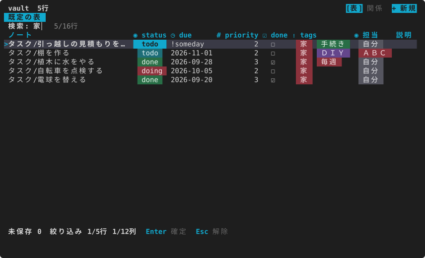

ここでの並べ替えや絞り込みは一時的なものです。ビューとして残すには [見せ方を決めて保存する](#見せ方を決めて保存する)。

## まとめて直す

1. `Space` で行に印を付ける(付けて1行下へ動く)。`v` で範囲、`Ctrl+A` で全部。
2. 印を付けた行のどれかで、直したい列のセルを `Enter` で開いて値を決める。
3. 印の付いた行に同じ値が入る。入れられない行(読むだけのノートなど)は飛ばし、数と理由が出る。

リストの列では、全部の行が持つ値は `[x]`、一部の行だけが持つ値は `[-]` で出ます。付け外しした値のほかは、各行の要素がそのまま残ります。

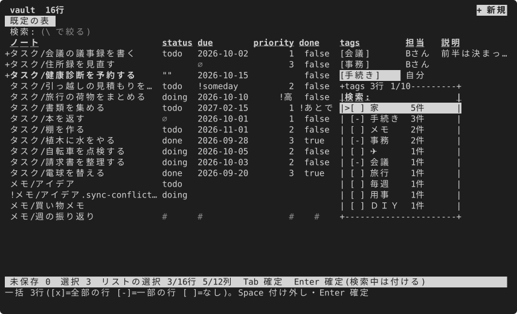

保存までは書かないので、`Ctrl+S` の差分でまとめて確かめられます。

## 新しいノートを作る

1. `a` か右上の「+ 新規」を押す。名前と、表の列ごとの欄が並んだ窓が開く。
2. 名前を打つ。`下/名前` と打てばその下のフォルダに作る(無いフォルダも作る)。`Enter`・`Tab` で次の欄、`Shift+Tab` で前の欄へ。欄は列の型に合った入れ方(候補・カレンダー・リスト)で直す。
3. どの欄からでも `Ctrl+S`(最後の欄なら `Enter`)で、すぐにファイルができ、作った行が選ばれる。`Ctrl+E` なら作ってすぐエディタで開く。

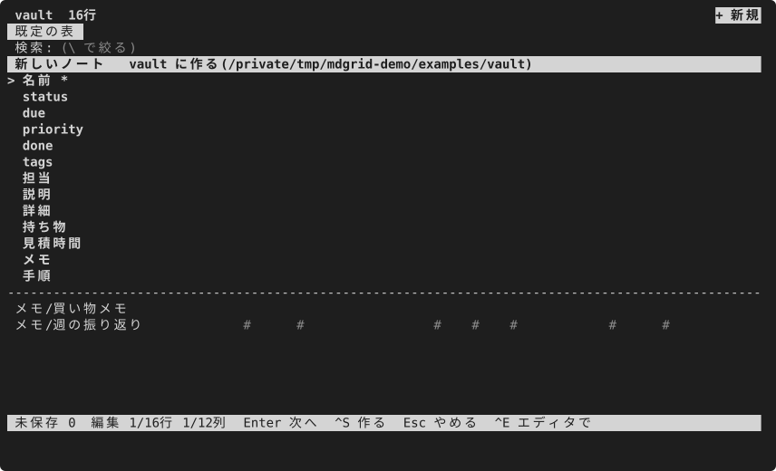

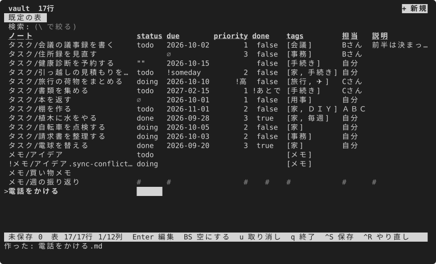

- フォルダを2つ以上開いたときは、先に作る場所を選びます。
- `status == "doing"` のように値が1つに決まる絞り込みのビューで作ると、その値が入り、ビューに残ります。
- 開いたフォルダの外や、既にある名前には作りません。`--readonly` では作れません。
- 窓の欄・必須の欄・前もって入れる値(`{date+7}`・`{now}` などの変数を使える)・作成日のように欄に出さずに入れる値・本文の雛形・窓を使うかすぐエディタで開くか(`mode = "editor"`)は、設定の [`new_note`](../../config.ja.md#new_note) で決めます。

## .base を開く

```sh
mdgrid /tmp/mdgrid-sample/タスク.base
mdgrid /tmp/mdgrid-sample/タスク.base --view 期限
```

`.base` の table ビューがタブに並び、先頭(か `--view` の名前)が開きます。`[`・`]` で切り替えます。filters・order・sort・groupBy・limit・displayName・formulas を読み、グループの見出しの行は `Enter` で畳めます。

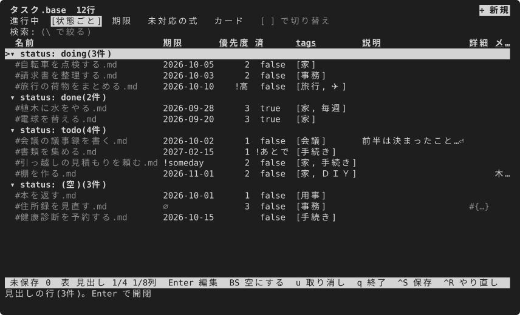

- 評価できない式の列は推測せず、薄い `?` を出します。選ぶと、どの式かが下に出ます。
- table 以外のビュー(カードなど)は開かずに理由を出します。
- mdgrid は `.base` を書き換えません。

解釈する項目・演算子・関数の一覧は [Obsidian Bases の対応範囲](../../obsidian-bases.ja.md) にあります。

## 見せ方を決めて保存する

`o` でビューの設定を開きます。`Tab` で区画を移ります。

- 列: 見せる列と順
- フィルター: 条件を足す。列を選ぶと値の一覧が件数つきで出て、残す・隠す値にチェックを付けられる
- 並べ替え・グループ
- 表示: 行番号・一行おきの色・列の区切り線・タブ・検索の欄・設定の帯

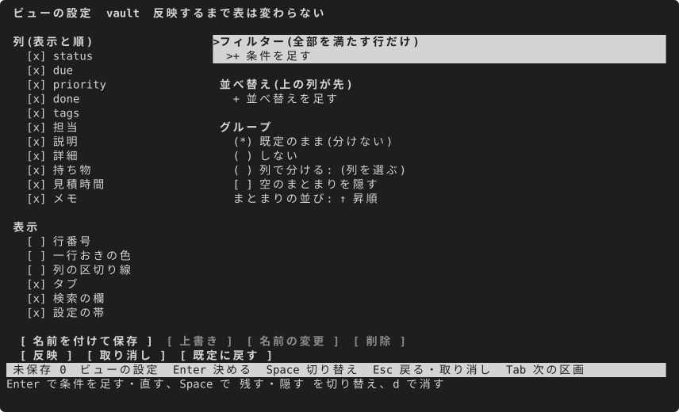

「反映」で表に効かせ、「名前を付けて保存」で mdgrid のビューとして残します。保存したビューは同じ画面の「上書き」「名前の変更」「削除」で直し、「既定に戻す」で設定を既定に戻せます。保存したビューは「既定の表」の横のタブになり、設定の置き場の `views.toml` に書かれます。効いている条件は表の上の設定の帯に並び、`f` で帯に入って `Backspace` で外せます。

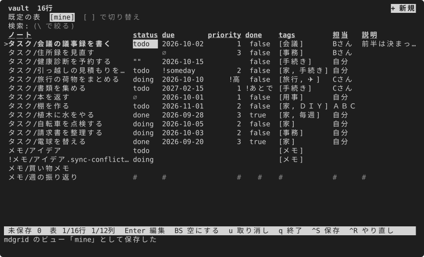

Obsidian と行き来するには、パレット(`:`)から:

- `export_base`: 今のビューを、名前を決めた新しい `.base` に書き出す(既にある `.base` は書き換えない)
- `import_base`: `.base` のビューを mdgrid のビューとして取り込む(持てない部分は、落とした項目として出る)

`--readonly` のときはビューの設定を覚えません。

## フォルダを自分のコマンドにする

mdgrid は開いたフォルダ(か `.base`)ごとに、見せる列とその並び・幅、`o` で決めた絞り込み・並べ替え・まとまり、畳んだまとまり、タブとして保存したビューを覚えていて、次に同じフォルダを開くと全部が戻ります。なので、シェルの alias を書くだけで、フォルダが自分のコマンドになります。

`~/.zshrc` か `~/.bashrc` に、フォルダごとに1行書きます:

```sh
alias tasks='mdgrid ~/notes/Tasks'
alias books='mdgrid ~/notes/Books'
alias meetings='mdgrid ~/notes/Meetings --readonly'   # 見るだけ
alias standup='mdgrid ~/notes/タスク.base --view 状態ごと'   # .base を1つのビューで開く
```

- `tasks` と打てば、前に使ったときのままのタスクの表が開きます。
- 覚えないもの: 列の見出しからの一時的な並べ替え、`\` の簡易の絞り込み、`--readonly` で開いたときに変えたこと。
- fish では `alias --save tasks 'mdgrid ~/notes/Tasks'` です。

出す側も、シェルの関数で同じように作れます:

```sh
todo() { mdgrid ~/notes/Tasks --print --format md --filter 'status != "done"' --sort due; }
pick-task() { mdgrid ~/notes/Tasks --pick path; }
```

## 使う表を登録して切り替える

よく開く表(フォルダか `.base`)は、名前と分類を付けて登録できます。開いている表でパレット(`:`)の **この表を登録** を選び、名前(今のビューかフォルダの名前が入っている)と分類(今の分類から選ぶか、新しく打つ)を決めます。同じ名前があれば置き換えるかを聞きます。

登録すると、引数なしの `mdgrid` で、分類ごとに並んだ一覧が今のフォルダの表の上に出ます。名前・分類・パスのどれでも打って絞り、Enter で開きます(登録したビューで開く)。

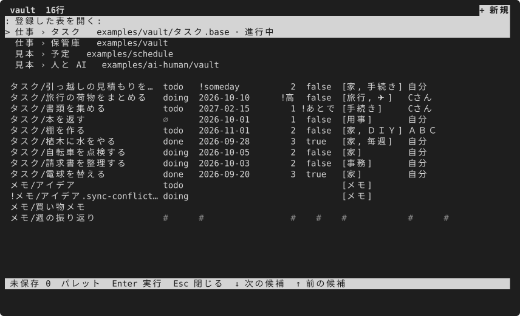

先頭の「今のフォルダ」か Esc で、今のフォルダの表のままです。表を開いている間も、パレットの **登録した表を開く** で同じ一覧が出ます。保存していない変更があれば、移る前に保存するか捨てるかを聞きます。

登録は、設定のフォルダの `places.toml`(`~/.config/mdgrid/places.toml`)に入ります。手で書いてもかまいません:

```toml
[[place]]
name = "タスク"
group = "仕事"
path = "~/notes/Tasks"

[[place]]
name = "本"
group = "趣味"
path = "~/notes/本.base"
view = "読んでいる"
```

`path` の先頭の `~` はホームのフォルダです。読めない行(`name` か `path` が無い、名前が重なる)は警告を出して飛ばします。ノートには何も書きません。

## リンクで表をつなぐ(リレーション)

ノートのフロントマターにほかのノートへのリンクを書くと、ノートのフォルダどうしを、つながった表(タスク → プロジェクト → メンバー)として扱えます。キーはノートのファイル名なので id の列は要らず、多対多はリンクのリストで書けるので中間の表も要りません。

```yaml
project: "[[mdgrid]]"            # プロジェクト1つ
assignee: "[[Alice]]"
related:                         # 複数
  - "[[Website]]"
  - "[mdgrid](../projects/mdgrid.md)"   # Markdown のリンクも、ただのパス(../projects/mdgrid)も使える
```

- リンクのセルは、行き先のノートの名前で出ます。行き先の無い `[[…]]` は、名前の前に `?` が付きます。
- 値の多くがリンクの列で Enter を押すと、行き先のフォルダのノートが名前で並びます。選んだノートは、その列で使われている形(無ければ `[[名前]]`)で書きます。リストの列では複数を付けられます。
- `:open_link`(か `x` の一覧の **リンクの行き先を開く**)で行き先を開きます。同じ表ならその行へ移り、違えばノートを含む登録した表(無ければノートのフォルダ)を開いて、その行を選びます。保存していない変更があれば先に確かめます。
- `:linked_rows` で、今のノートを指しているノートを、どの表のどの列からかと一緒に並べます。選ぶとそのノートを開きます。
- フォルダを開いても `.base` を開いても同じに効き、行き先は開いたフォルダの外でもかまいません。つなぐフォルダを登録しておくと(上の節)、名前がフォルダをまたいで解けます。ただのパスは、`/` を含むか `.md` で終わり、ノートが実際にあるときだけリンクとみなすので、普通の言葉は文字のままです。

見本 `examples/relations` は、この形でつないだタスク・プロジェクト・メンバーです: `mdgrid examples/relations/tasks`。

## ほかのコマンドと組む

今見えている表(絞り込み・並べ替え・隠した列を当てたもの)をそのまま残すには、パレット(`:`)で **表をファイルに書き出す** を選び、ファイルの名前を打ちます。形は拡張子(`.csv`・`.tsv`・`.json`・`.md`)で決まります。先頭の列は各ノートのパスなので、CSV と JSON は `--apply` で戻せます。

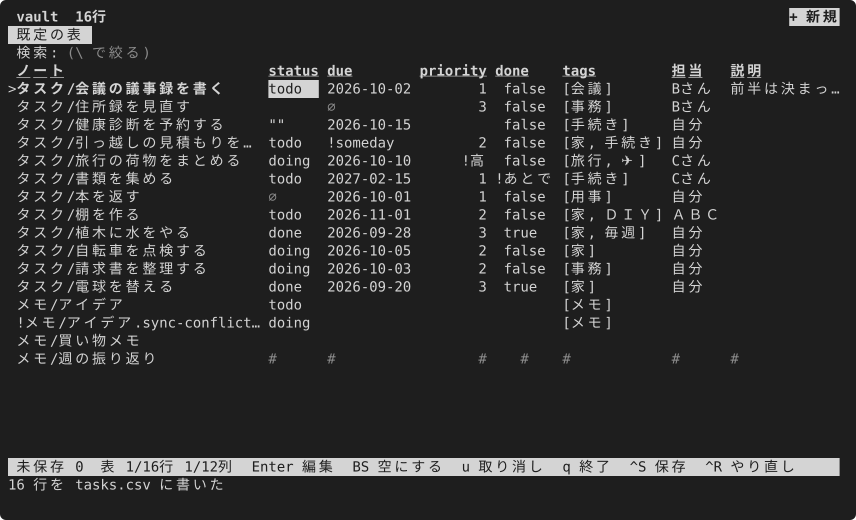

画面を出さずに、ビューの表を標準出力に出します(既定は csv。ノートは書き換えない)。

```sh
mdgrid /tmp/mdgrid-sample/タスク.base --print
mdgrid /tmp/mdgrid-sample/タスク.base --print --format json | jq .
mdgrid /tmp/mdgrid-sample --print --format md > 表.md
mdgrid /tmp/mdgrid-sample --print --format tsv > 表.tsv
```

フォルダを `--print` すると、ノートの名前の列は出ません(列はフロントマターのキーだけ)。

画面で行を選んで、そのパスか列の値を出します。画面は読むだけで、`Enter` で印を付けた行(無ければ選んでいる行)を1行ずつ出して終わります。`q` で取りやめると何も出さず、終了コードは 1 です。

```sh
mdgrid /tmp/mdgrid-sample --pick path | xargs -o vi    # 選んだノートを開く
mdgrid /tmp/mdgrid-sample --pick status
```

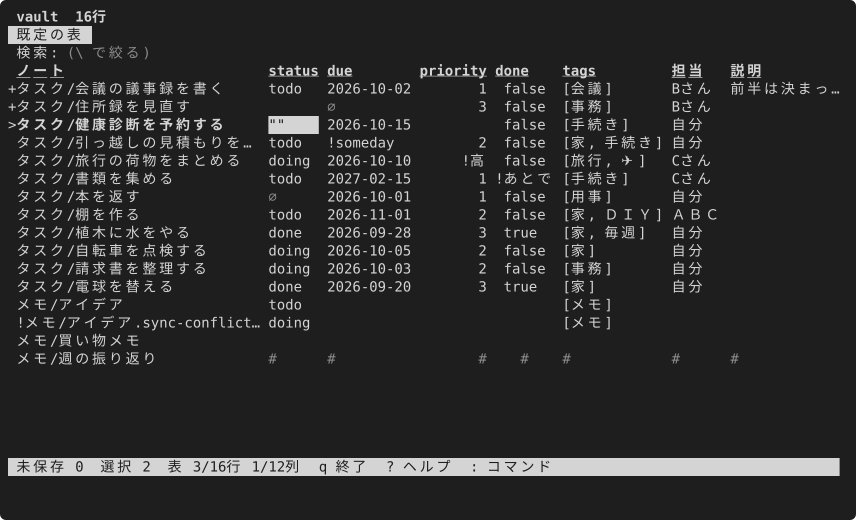

表のセルは `y`(か `Ctrl+C`)、行全体は `Y` でクリップボードにコピーできます。

## テーマを選ぶ

設定に `theme = "nord"` のように1行書くと、画面の色が変わります。7つのテーマの見本と選び方は [テーマ](themes.md) のページにあります。

## 直せないとき

| 見えること | わけ | どうするか |
|---|---|---|
| 行のセルに `#` が並ぶ | フロントマターを安全に書けないノート(キーの重複・BOM・改行コードの混在など) | 選ぶと理由が出る。エディタ(`e`)で直す。理由の一覧は [読むだけのノート](../../safety.ja.md#読むだけのノート) |
| `Enter` で「読むだけ」と出る | ネストした値・ブロックスカラー・`file.*` や `formula.*` の列 | [読むだけの値](../../safety.ja.md#読むだけの値) |
| 改行を含む値が直せない | 1行の入力では直せない | `e` でエディタで開く |
| 日付や数が受け付けられない | 実在しない日付、数として読めない値 | 入力は開いたままなので打ち直す |
| 行の頭に `!` | 同期の道具が作った競合ファイルか、変更をためている間に外で変わったノート | 競合ファイルは手で片付ける。外で変わったノートは保存の確認で上に書くか(`o`)、変更を捨てる(`d`) |
| 何も書けない | `--readonly` で開いた | 付けずに開き直す |

直している間に外でノートが変わると、mdgrid は自動で読み直します(編集中は止まる)。保存のときに変わっていたら、確認の画面でそれを示します。
